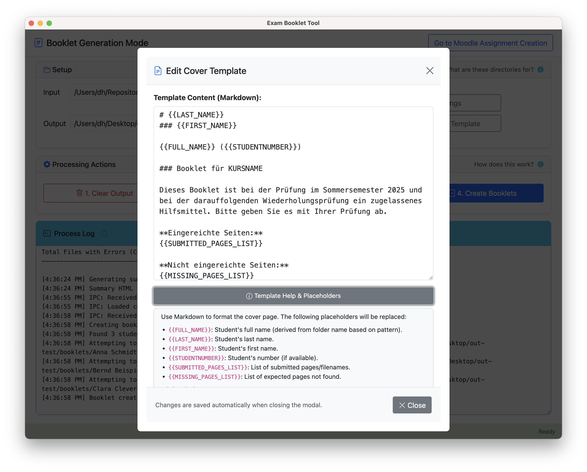

# Booklet Tool

[](https://github.com/UBA-PSI/klausur-booklets/releases/latest)
[](https://github.com/UBA-PSI/klausur-booklets/releases)

> **Create personalised exam booklets from students' handwritten note pages in minutes.**
> Download the latest version for **Windows · macOS · Linux** and get started right away.

The Booklet Tool is an Electron application (Windows, macOS, Linux) developed at the [Chair of Privacy and Security in Information Systems](https://www.uni-bamberg.de/psi/), University of Bamberg, designed to help instructors create personalized exam aids ("Klausur-Booklets") from student submissions.

This tool facilitates the "Klausur-Booklet" incentive system as described at [www.uni-bamberg.de/psi/teaching/booklet-tool/](https://www.uni-bamberg.de/psi/teaching/booklet-tool/). Students submit note pages regularly during the semester, and instructors use this tool to compile these submissions (along with generated cover sheets) into printed A5 booklets allowed during the final exam.

<details>
  <summary><b>Learn more about the Klausur-Booklet concept</b></summary>

  The pedagogical concept, organizational aspects, and benefits of the Klausur-Booklet incentive system are described in the following book chapter (in German):

  > Herrmann, Dominik (2024). Klausur-Booklets zur Stärkung von Methodenkompetenzen und zur Reduktion von Prokrastination. In: Theresia Witt/ Carmen Herrmann/ Lorenz Mrohs/ Hannah Brodel/ Konstantin Lindner/ Ilona Maidanjuk (Eds.), _Diversität und Digitalität in der Hochschullehre_ (pp. 169-180). Bielefeld: transcript Verlag. <https://doi.org/10.14361/9783839469385-013>

  **Abstract:**
  > Studying during the semester often fails due to a lack of methodological competence and a tendency to procrastinate. One solution to this is the concept of Exam Booklets: Lecturers allow their students to create up to 15 handwritten sheets of paper during the semester and use them as aids in the exam. Exam booklets overcome the disadvantages of open-book exams and other incentive systems such as midterm exams and bonus points. They provide a strong incentive for students, can improve the examination culture, and are easy to implement with the organizational and technical experience obtained so far. In light of this, it seems sensible to make more room for teaching methodological skills in existing courses.

</details>

## Quick  Start for Instructors

1. **Download** the latest release for your platform from the [Releases page](https://github.com/UBA-PSI/klausur-booklets/releases/latest) and unzip it.
2. **Launch** *Booklet Tool* and click **Go to Moodle Assignment Creation** to create the `.mbz` file for your course.
3. **Restore** the obtained `.mbz` file in Moodle and tell students to upload their weekly pages.
4. **After the last deadline** or at any time during the semester, download all submissions, unzip them into a single folder, select that folder in the Booklet Tool, and create booklets in three steps: **Convert to PDFs**, **Merge PDFs**, and **Create Booklets**.
5. **Print** the generated A5 PDFs double‑sided and hand them out in the exam.

_That's it  – no command line required._

## Features

- Processes individual student PDF submissions.
- Generates cover sheets that list student information and highlight missing submissions.
- Merges cover sheets and submitted pages into complete, personalized booklets.
- Creates print-ready A5 booklets with correct imposition.
- Optionally generates Moodle Backup (MBZ) files to easily create corresponding assignment activities in Moodle.

### Interface Highlights

<table>
  <tr>
    <td></td>
    <td></td>
  </tr>
  <tr>
    <td align="center"><sub>Moodle Assignment Creator</sub></td>
    <td align="center"><sub>Settings Editor</sub></td>
  </tr>
  <tr>
    <td></td>
    <td></td>
  </tr>
  <tr>
    <td align="center"><sub>Cover Template Editor</sub></td>
    <td align="center"><sub>Resulting Booklets</sub></td>
  </tr>
</table>


### Supported Learning Management Systems

- Built for **Moodle**: automatically matches students' uploads stored in FULLNAMEWITHSPACES_SOMENUMBER_assignment_file_ folders.
- Should also work with **Ilias**: submission activities having folder names like FIRSTNAME_LASTNAME_USERNAME_STUDENTNUMBER are supported
- Works with custom folder structures.


## System Requirements

| Component | Minimum version | Needed for |
|-----------|-----------------|------------|
| Windows, macOS, or Linux | 64‑bit | Running the pre‑built desktop app |
| Node.js | 18 LTS | For developers who want to build the application from source |
| Python | 3.7 | Optional CLI for MBZ modification |


## Documentation

Read the [Documentation for instructors](docs/documentation.md) and the [Student Guide](docs/student-guide.md).


## Data Protection

Student notes are sensitive personal data and should not be uploaded to third-party services. The Booklet Tool has been designed with data protection considerations in mind:

- All processing occurs locally on the instructor's machine
- No data is shared with third parties
- The application makes no network requests
- All functionality runs entirely locally

While these measures help safeguard student data, instructors should still:
- Check with their local data protection officers regarding the legal basis for processing
- Determine appropriate ways to inform students about the data processing involved in creating booklet pages
- Follow institutional guidelines for handling student submissions


## For Developers

### Setup & Running

1.  **Clone the Repository:**
    ```bash
    git clone <repository-url> # Replace with actual URL
    cd booklet-tool
    ```

2.  **Install Node.js Dependencies:**
    ```bash
    npm install
    ```

3.  **Run the Application:**
    ```bash
    npm start
    ```

### Building for Distribution

To create distributable packages for macOS, Windows (portable), and Linux (AppImage):

```bash
npm run build
```

This command will:
1.  Build the platform-specific application bundles in the `dist/` directory.
2.  Create a `dist/booklet-tool-testdata.zip` file containing sample input PDFs for testing the tool's functionality. Unzip this file and use the contained folders/files as input within the Booklet Tool.

### Configuration

PDF processing settings (like DPI) can be adjusted via the Settings button within the application.

### Standalone Python MBZ Modifier (Optional)

This repository also contains a standalone Python script for modifying Moodle Backup (MBZ) files, located in the `python-cli/` directory. This script provides similar functionality to the MBZ creation feature within the Electron app but runs directly from the command line.

- **Script:** `python-cli/modify_moodle_backup.py`
- **Test:** `python-cli/test_modify_moodle.py`

This Python tool is independent of the Electron application and does not require Node.js or the Electron environment. It uses only standard Python libraries and does not have external dependencies (no `requirements.txt` needed).

To use it, run directly with Python 3.7+:
```bash
python3 python-cli/modify_moodle_backup.py --help
```

## Changelog

See [CHANGELOG.md](CHANGELOG.md) for release notes.

## License

This project is licensed under the MIT License - see the [LICENSE.txt](LICENSE.txt) file for details.

## Author

Dominik Herrmann (dh.psi@uni-bamberg.de)
Chair of Privacy and Security in Information Systems
University of Bamberg 

During development, the following GenAI models have been used for design, implementation, and writing documentation: Anthropic Claude Sonnet 3.7, OpenAI GPT 4.1/4.5/o3, Google Gemini 2.5 Pro Experimental.