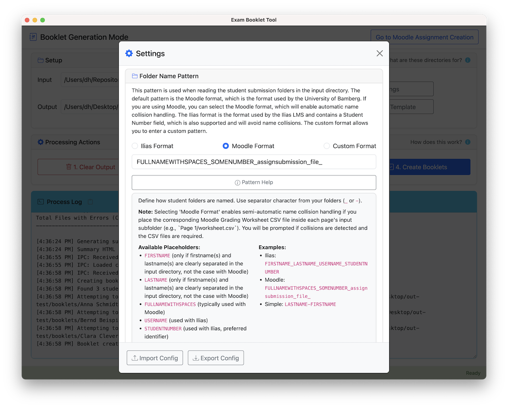
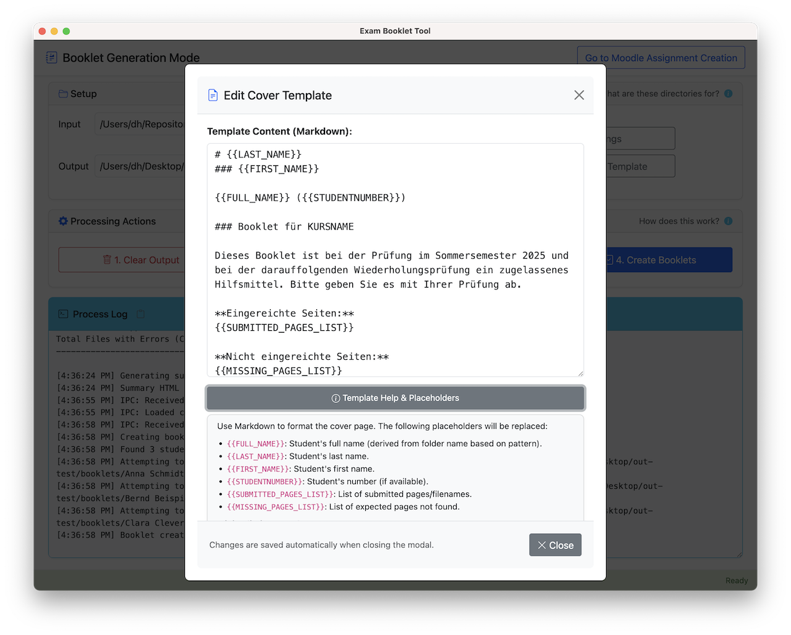

# Booklet Tool

[](https://github.com/UBA-PSI/klausur-booklets/releases/latest)
[](https://github.com/UBA-PSI/klausur-booklets/releases)

**Create personalized exam booklets from students' handwritten note pages in minutes.**
Download the latest version for [**Windows**](https://github.com/UBA-PSI/klausur-booklets/releases/download/v1.0.1/Booklet-Tool.1.0.1-win-portable.exe) · [**macOS**](https://github.com/UBA-PSI/klausur-booklets/releases/download/v1.0.1/Booklet-Tool-1.0.1-mac-universal.dmg) · [**Linux**](https://github.com/UBA-PSI/klausur-booklets/releases/) and get started right away.

[**Download test data**](https://github.com/UBA-PSI/klausur-booklets/releases/download/v1.0.1/booklet-tool-testdata.zip) to try out the tool's features.

The Booklet Tool is an Electron application (Windows, macOS, Linux) developed at the [Chair of Privacy and Security in Information Systems](https://www.uni-bamberg.de/psi/), University of Bamberg, within [Projekt DiKuLe](https://www.uni-bamberg.de/dikule/). The Booklet Tool helps instructors create personalized exam aids ("Klausur-Booklets") from student submissions.

This tool facilitates the [Klausur-Booklet](https://www.uni-bamberg.de/psi/teaching/booklet-tool/) incentive system. Students submit note pages regularly during the semester, and instructors use this tool to compile these submissions (along with generated cover sheets) into printed A5 booklets that students can use as authorized aids during the final exam.

<details>
  <summary><b>Learn more about the Klausur-Booklet concept</b></summary>

  The pedagogical concept, organizational aspects, and benefits of the Klausur-Booklet incentive system are described in the following **open access book chapter** (in German):

  > Herrmann, Dominik (2024). Klausur-Booklets zur Stärkung von Methodenkompetenzen und zur Reduktion von Prokrastination. In: Theresia Witt, Carmen Herrmann, Lorenz Mrohs, Hannah Brodel, Konstantin Lindner, Ilona Maidanjuk (Eds.), _Diversität und Digitalität in der Hochschullehre_ (pp. 169-180). Bielefeld: transcript Verlag. <https://doi.org/10.14361/9783839469385-013>

  **Abstract:**
  > Studying during the semester often fails due to a lack of methodological competence and a tendency to procrastinate. One solution to this is the concept of Exam Booklets: Lecturers allow their students to create up to 15 handwritten sheets of paper during the semester and use them as aids in the exam. Exam booklets overcome the disadvantages of open-book exams and other incentive systems such as midterm exams and bonus points. They provide a strong incentive for students, can improve the examination culture, and are easy to implement with the organizational and technical experience obtained so far. In light of this, it seems sensible to make more room for teaching methodological skills in existing courses.

</details>

## Quick Start for Instructors

1. **Download** the latest release for your platform from the [Releases page](https://github.com/UBA-PSI/klausur-booklets/releases/latest) and unzip it.
2. **Launch** *Booklet Tool* and click **Go to Moodle Assignment Creation** to create the `.mbz` file for your course.
3. **Restore** the obtained `.mbz` file in Moodle and tell students to upload their weekly pages.
4. **After the last deadline** or at any time during the semester, download all submissions, unzip them into a single folder, select that folder in the Booklet Tool, and create booklets in three steps: **Convert to PDFs**, **Merge PDFs**, and **Create Booklets**.
5. **Print** the generated A5 PDFs double‑sided and hand them out in the exam.

_That's it  – no command line required._

## Features

**First Stage:** Set up Moodle for collection of booklet pages.

- Use the Booklet Tool to generate a Moodle Backup (MBZ) file with multiple assignment activities to collect individual pages at certain deadlines.

**Second Stage:** Create booklets.

- Booklet Tool processes individual student PDF submissions automatically.
- Generates cover sheets that list student information and highlight missing submissions.
- Merges cover sheets and submitted pages into complete, personalized booklets.
- Creates print-ready A5 booklets with correct imposition.
- Booklet Tool creates a Summary HTML file listing all students and the number of pages.

### Interface Highlights

<table>
  <tr>
    <td></td>
    <td></td>
  </tr>
  <tr>
    <td align="center"><sub>Moodle Assignment Creator</sub></td>
    <td align="center"><sub>Settings Editor</sub></td>
  </tr>
  <tr>
    <td></td>
    <td></td>
  </tr>
  <tr>
    <td align="center"><sub>Cover Template Editor</sub></td>
    <td align="center"><sub>Resulting Booklets</sub></td>
  </tr>
</table>


### Supported Learning Management Systems

- Built for **Moodle**: automatically matches students' uploads stored in FULLNAMEWITHSPACES_SOMENUMBER_assignment_file_ folders.
- Should also work with **Ilias**: submission activities having folder names like FIRSTNAME_LASTNAME_USERNAME_STUDENTNUMBER are supported
- Works with custom folder structures.


## Documentation

Read the [Documentation for instructors](docs/documentation.md) and the [Student Guide](docs/student-guide.md).


## Data Protection

Student notes are sensitive personal data and should not be uploaded to third-party services. The Booklet Tool has been designed with data protection considerations in mind:

- All processing occurs locally on the instructor's machine
- No data is shared with third parties
- The application makes no network requests
- All functionality runs entirely locally

While these measures help safeguard student data, instructors should still:
- Check with their local data protection officers regarding the legal basis for processing
- Determine appropriate ways to inform students about the data processing involved in creating booklet pages
- Follow institutional guidelines for handling student submissions


## Known Limitations

<details>
  <summary>CSV Format for Name Collision Resolution</summary>

  - When using Grading Worksheet CSV files for automated name collision resolution (necessary in Moodle environments if multiple students share the same name), the CSV file must adhere to specific formatting requirements currently hardcoded in `src/js/main.js`:
    - It **must** contain a column containing `id` (case-insensitive) which includes the `SOMENUMBER` found in Moodle's submission folder names (e.g., `FULLNAMEWITHSPACES_SOMENUMBER_assignsubmission_file_`).
    - It **must** contain a column for student email addresses, and the header for this column **must** include one of the following substrings (case-insensitive): `email`, `e-mail`, `mail-adresse`, or `e-mail-adresse`.
  - Using other unique identifiers potentially available in Moodle exports (like student ID number) is not currently supported for collision resolution. If your Moodle instance provides such identifiers and you need this feature, please contact the author.
</details>

<details>
  <summary>Single-Threaded Processing</summary>

  - The conversion of submitted files (images, PDFs) to the standardized PDF format is currently performed single-threaded. Processing a large number of student submissions, especially if they contain many high-resolution images or complex PDFs, can take a significant amount of time.
</details>

<details>
  <summary>Fixed Page Format</summary>

  - The tool generates intermediate PDFs in A5 format and final booklets intended for A4 paper (printed double-sided, flipped on the short edge). These formats are currently fixed and cannot be configured within the application. You might be able to scale the output to different paper sizes using your printer's settings.
</details>

<details>
  <summary>Moodle-Specific Feature: MBZ Creation</summary>

  - **MBZ Creation:** The feature for automatically generating Moodle Backup (`.mbz`) files to set up assignment activities is specific to Moodle and does not support other Learning Management Systems like Ilias.
</details>

<details>
  <summary>At Least Two Assignments Needed</summary>

  - **MBZ Assignment Limit:** Due to peculiarities in creating the MBZ files, you have to specify **at least two activities** when creating an MBZ file. Generating an MBZ for a single assignment is not possible and will result in an error during Moodle import.

</details>

<details>
  <summary>Only One Deadline Per Day</summary>

  - **Simplistic Design:** Due to limitations in the Booklet Tool, every day in the calendar can only have one assignment activity deadline. If you want students to be able to submit more than one page per day, you have to use different dates and make changes to the deadline in Moodle after importing the file.

</details>


<details>
  <summary>No Support for Booklet Preview/Distribution</summary>

  - The tool currently offers no built-in mechanism to easily distribute the generated individual student booklets back to the students for preview before the exam.
  - The generated PDFs are placed in the `pdfs/<Student Name>.pdf` subdirectories within the chosen output folder. The filenames are fixed based on the student name or email address.
  - A possible workaround for distribution might involve manually uploading these PDFs as feedback files to the corresponding Moodle assignments, but this workflow is not automated by the tool.
</details>

<details>
  <summary>User Interface Language</summary>

  - The user interface of the Booklet Tool is currently only available in English.
  - However, all text elements intended for students (e.g., on the cover sheet) can be customized by the instructor via the Cover Template Editor.
</details>

<details>
  <summary>Naive First/Last Name Splitting (Moodle)</summary>

  - When parsing Moodle folder names (e.g., `Firstname Middlename Lastname_SOMENUMBER_...`), the tool assumes the part after the *last* space is the student's last name.
  - This naive logic will lead to incorrect last names (and consequently, incorrect cover sheets and summary sorting) for students whose actual last name contains spaces (e.g., "van der Berg", "de la Cruz").
  - Currently, there is no workaround for this other than manually correcting the cover sheets with a PDF editor if needed.
</details>


## System Requirements

| Component | Minimum version | Needed for |
|-----------|-----------------|------------|
| Windows, macOS, or Linux | 64‑bit | Running the pre‑built desktop app |
| Node.js | 18 LTS | For developers who want to build the application from source |
| Python | 3.7 | Optional CLI for MBZ modification |


### Notes for Linux (particularly Ubuntu 24.04)

To run the AppImage on Linux, you may have to install two additional packages. On Ubuntu 24.04, use this command:

```
sudo apt install libfuse2 zlib1g-dev
```

Moreover, changes introduced with Ubuntu 24.04 and its AppArmor protection prevent the Electron app from creating its sandbox. As a result, nothing happens when the AppImage is double-clicked. When the AppImage is started on the command line, you see a permissions error. This error on Ubuntu 24.04 is due to new AppArmor restrictions that limit unprivileged user namespaces. This security feature was introduced to prevent certain types of attacks, but it affects legitimate applications like Electron-based AppImages that rely on sandboxing.

You *can* disable the sandbox by running the AppImage file on the command line with `--no-sandbox`, put this reduces the security protections offered by the sandbox. Alternatively, you can create a new AppArmor profile for the app:

```
sudo nano /etc/apparmor.d/your-appimage
```

with content (change the path to match your environment)

```
# Allow your specific AppImage to run with proper sandbox permissions
abi <abi/4.0>,
include <tunables/global>

profile appimage.your-tool /path/to/your-AppImage flags=(complain) {
  userns,
  include if exists <local/appimage.your-tool>
}
```

Then run

```
sudo apparmor_parser -r /etc/apparmor.d/your-appimage
```


## For Developers

### Setup & Running

1.  **Clone the Repository:**
    ```bash
    git clone <repository-url> # Replace with actual URL
    cd booklet-tool
    ```

2.  **Install Node.js Dependencies:**
    ```bash
    npm install
    ```

3.  **Run the Application:**
    ```bash
    npm start
    ```

### Building for Distribution

To create distributable packages for macOS, Windows (portable), and Linux (AppImage):

```bash
npm run build
```

This command will:
1.  Build the platform-specific application bundles in the `dist/` directory.
2.  Create a `dist/booklet-tool-testdata.zip` file containing sample input PDFs for testing the tool's functionality. Unzip this file and use the contained folders/files as input within the Booklet Tool.

### Configuration

PDF processing settings (like DPI) can be adjusted via the Settings button within the application.

### Standalone Python MBZ Modifier (Optional)

This repository also contains a standalone Python script for modifying Moodle Backup (MBZ) files, located in the `python-cli/` directory. This script provides similar functionality to the MBZ creation feature within the Electron app but runs directly from the command line.

- **Script:** `python-cli/modify_moodle_backup.py`
- **Test:** `python-cli/test_modify_moodle.py`

This Python tool is independent of the Electron application and does not require Node.js or the Electron environment. It uses only standard Python libraries and does not have external dependencies (no `requirements.txt` needed).

To use it, run directly with Python 3.7+:
```bash
python3 python-cli/modify_moodle_backup.py --help
```

## Changelog

See [CHANGELOG.md](CHANGELOG.md) for release notes.

## License

This project is licensed under the MIT License - see the [LICENSE.txt](LICENSE.txt) file for details.

## Author

Dominik Herrmann (dh.psi@uni-bamberg.de)
Chair of Privacy and Security in Information Systems
University of Bamberg 

During development, the following GenAI models have been used for design, implementation, and writing documentation: Anthropic Claude Sonnet 3.7, OpenAI GPT 4.1/4.5/o3, Google Gemini 2.5 Pro Experimental.