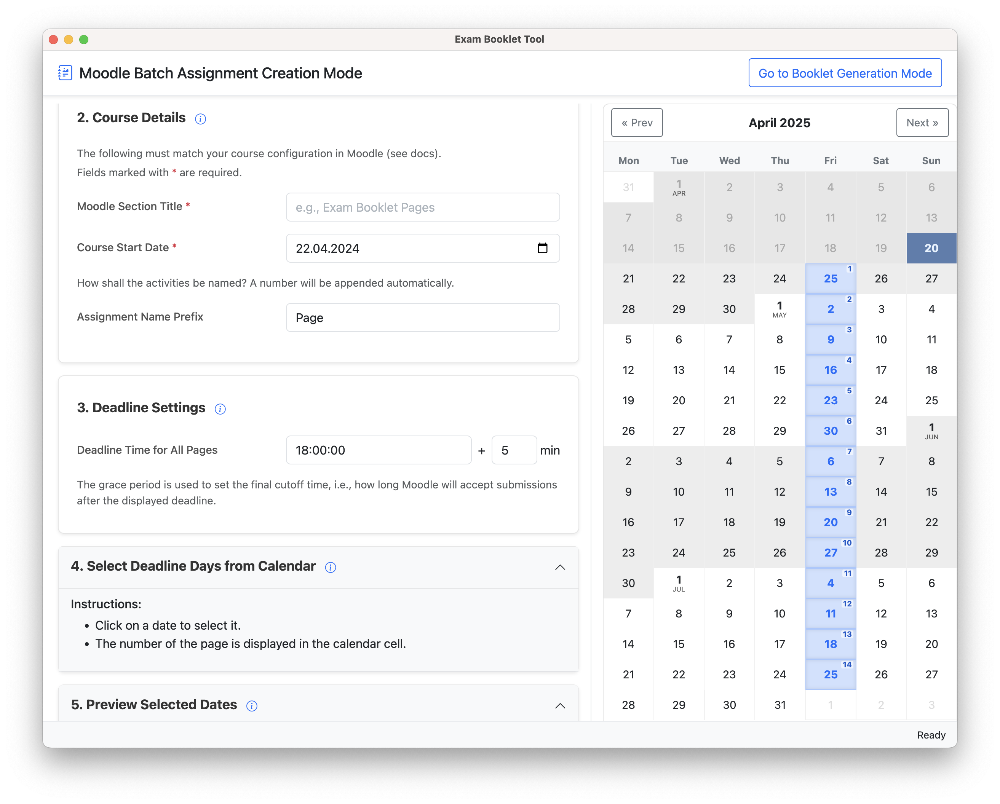

# Booklet Tool

[](https://github.com/UBA-PSI/klausur-booklets/releases/latest)
[](https://github.com/UBA-PSI/klausur-booklets/releases)

**Create personalized exam booklets from students' handwritten note pages in minutes.**
Download the latest version for [**Windows**](https://github.com/UBA-PSI/klausur-booklets/releases/download/v1.7.0/Booklet.Tool.1.7.0.exe) · [**macOS**](https://github.com/UBA-PSI/klausur-booklets/releases/download/v1.7.0/Booklet.Tool-1.7.0.dmg) · [**Linux**](https://github.com/UBA-PSI/klausur-booklets/releases/tag/v1.7.0) and get started right away. [**Download test data**](https://github.com/UBA-PSI/klausur-booklets/releases/download/v1.7.0/booklet-tool-testdata.zip) to try out the tool's features.

The Booklet Tool is an Electron application (Windows, macOS, Linux) developed at the [Chair of Privacy and Security in Information Systems](https://psi.uni-bamberg.de/), University of Bamberg, within [Projekt DiKuLe](https://www.uni-bamberg.de/dikule/). The Booklet Tool helps instructors create personalized exam aids ("Klausur-Booklets") from student submissions.

This tool facilitates the [Klausur-Booklet](https://psi.uni-bamberg.de/en/lehre/booklet/) incentive system. Students submit note pages regularly during the semester, and instructors use this tool to compile these submissions (along with generated cover sheets) into printed A5 booklets that students can use as authorized aids during the final exam.

<details>
  <summary><b>Learn more about the Klausur-Booklet concept</b></summary>

  The pedagogical concept, organizational aspects, and benefits of the Klausur-Booklet incentive system are described in the following **open access book chapter** (in German):

  > Herrmann, Dominik (2024). Klausur-Booklets zur Stärkung von Methodenkompetenzen und zur Reduktion von Prokrastination. In: Theresia Witt, Carmen Herrmann, Lorenz Mrohs, Hannah Brodel, Konstantin Lindner, Ilona Maidanjuk (Eds.), _Diversität und Digitalität in der Hochschullehre_ (pp. 169-180). Bielefeld: transcript Verlag. <https://doi.org/10.14361/9783839469385-013>

  **Abstract:**
  > Studying during the semester often fails due to a lack of methodological competence and a tendency to procrastinate. One solution to this is the concept of Exam Booklets: Lecturers allow their students to create up to 15 handwritten sheets of paper during the semester and use them as aids in the exam. Exam booklets overcome the disadvantages of open-book exams and other incentive systems such as midterm exams and bonus points. They provide a strong incentive for students, can improve the examination culture, and are easy to implement with the organizational and technical experience obtained so far. In light of this, it seems sensible to make more room for teaching methodological skills in existing courses.

</details>

## Quick Start for Instructors

1. **Download** the latest release for your platform from the [Releases page](https://github.com/UBA-PSI/klausur-booklets/releases/latest) and unzip it.
2. **Set up assignments** in your LMS (Moodle or ILIAS) for students to submit their pages.
3. **Moodle only:** Export the assignment section as a backup (`.mbz`), load it into the *Booklet Tool*'s **MBZ Modifier** (top right corner), configure names and deadlines, and restore the modified `.mbz` back into Moodle.
4. **After the last deadline** or at any time during the semester, download all submissions, unzip them into a single folder, select that folder in the Booklet Tool, and create booklets in three steps: **Convert to PDFs**, **Merge PDFs**, and **Create Booklets**.
5. **Print** the generated A5 PDFs double-sided and hand them out in the exam.

_That's it  – no command line required._

## Recommended: Install Ghostscript

The built-in PDF renderer (PDFium WASM) works out of the box but may fail with complex or large PDF files. For best results, install Ghostscript:

| Platform | Installation |
|---|---|
| macOS | `brew install ghostscript` (requires [Homebrew](https://brew.sh/)) |
| Windows | Download from [ghostscript.com](https://ghostscript.com/releases/gsdnld.html) and add to system PATH |
| Linux | `sudo apt install ghostscript` (Debian/Ubuntu) or `sudo dnf install ghostscript` (Fedora) |

After installation, open the Booklet Tool Settings and select **Ghostscript** as the PDF renderer.

### Why Ghostscript?

The Booklet Tool needs to rasterize submitted PDF pages (convert them to images) before assembling them into booklets. Two renderers are available:

- **PDFium WASM (built-in):** A WebAssembly-based renderer that runs inside the app without additional software. It handles simple PDFs well, but may produce rendering errors with complex PDFs (e.g., transparency, blend modes, advanced shading), and can run into memory limits with large or high-resolution files — especially on Windows.
- **Ghostscript (recommended):** A mature, battle-tested PostScript/PDF interpreter that runs as an external process. It handles virtually all PDF features correctly, processes large files reliably, and produces consistent output across platforms.

If you process student submissions that include scanned documents, annotated PDFs, or pages exported from different applications, Ghostscript will give you noticeably better and more reliable results.

## Features

**First Stage:** Set up Moodle for collection of booklet pages.

- The Booklet Tool includes an **MBZ Modifier** (accessible via the button in the top right corner of the main window) that lets you load a Moodle Backup (`.mbz`) file and configure all assignment deadlines and names at once.

**Second Stage:** Create booklets.

- Booklet Tool processes individual student PDF submissions automatically.
- Generates cover sheets that list student information and highlight missing submissions.
- Merges cover sheets and submitted pages into complete, personalized booklets.
- Creates print-ready A5 booklets with correct imposition.
- Generates a page count summary (TXT + XLSX) listing all students, page counts, and A4 sheets needed for printing.
- Smart margin enforcement: automatically scales down borderless pages to ensure a minimum margin for clean printing.
- Configurable minimum margin and optional padding to a multiple of 4 pages for saddle-stitch booklet printing.

### Interface Highlights

<table>
  <tr>
    <td></td>
    <td></td>
  </tr>
  <tr>
    <td align="center"><sub>MBZ Modifier</sub></td>
    <td align="center"><sub>Settings Editor</sub></td>
  </tr>
  <tr>
    <td></td>
    <td></td>
  </tr>
  <tr>
    <td align="center"><sub>Cover Template Editor</sub></td>
    <td align="center"><sub>Resulting Booklets</sub></td>
  </tr>
</table>


### Supported Learning Management Systems

- **Moodle**: Download and extract ZIP files from each assignment. The tool automatically processes the folder structure.
- **ILIAS**: Supports both per-assignment and per-student ZIP exports. Place all downloaded ZIP files (without extracting) in the input directory—the tool automatically detects the format and processes them.
- **Custom folder structures**: Works with any folder naming pattern via settings.


## Documentation

*   **Instructor Guides:** [English](docs/documentation.md) | [Deutsch](docs/documentation-de.md)
*   **Student Guides:** [English](docs/student-guide.md) | [Deutsch](docs/student-guide-de.md)


## Data Protection

Student notes are sensitive personal data and should not be uploaded to third-party services. The Booklet Tool has been designed with data protection considerations in mind:

- All processing occurs locally on the instructor's machine -- the application makes no network requests
- No data is shared with third parties

While these measures help safeguard student data, instructors should still:
- Check with their local data protection officers regarding the legal basis for processing
- Determine appropriate ways to inform students about the data processing involved in creating booklet pages
- Follow institutional guidelines for handling student submissions


## Known Limitations

<details>
  <summary>CSV Format for Name Collision Resolution</summary>

  - When using Grading Worksheet CSV files for automated name collision resolution (necessary in Moodle environments if multiple students share the same name), the CSV file must adhere to specific formatting requirements currently hardcoded in `src/js/main.js`:
    - It **must** contain a column containing `id` (case-insensitive) which includes the `SOMENUMBER` found in Moodle's submission folder names (e.g., `FULLNAMEWITHSPACES_SOMENUMBER_assignsubmission_file_`).
    - It **must** contain a column for student email addresses, and the header for this column **must** include one of the following substrings (case-insensitive): `email`, `e-mail`, `mail-adresse`, or `e-mail-adresse`.
  - Using other unique identifiers potentially available in Moodle exports (like student ID number) is not currently supported for collision resolution. If your Moodle instance provides such identifiers and you need this feature, please contact the author.
</details>

<details>
  <summary>Single-Threaded Processing</summary>

  - The conversion of submitted files (images, PDFs) to the standardized PDF format is currently performed single-threaded. Processing a large number of student submissions, especially if they contain many high-resolution images or complex PDFs, can take a significant amount of time.
</details>

<details>
  <summary>Fixed Page Format</summary>

  - The tool generates intermediate PDFs in A5 format and final booklets intended for A4 paper (printed double-sided, flipped on the short edge). These formats are currently fixed and cannot be configured within the application. You might be able to scale the output to different paper sizes using your printer's settings.
</details>

<details>
  <summary>Moodle-Specific Feature: MBZ Modifier</summary>

  - The MBZ Modifier, which adjusts assignment deadlines and names in Moodle Backup (`.mbz`) files, is specific to Moodle and does not support other Learning Management Systems like ILIAS.
</details>

<details>
  <summary>At Least Two Assignments Needed</summary>

  - **MBZ Assignment Limit:** The template `.mbz` file must contain **at least two assignment activities**. An `.mbz` with a single assignment will result in an error during Moodle import.

</details>

<details>
  <summary>No Support for Booklet Preview/Distribution</summary>

  - The tool currently offers no built-in mechanism to easily distribute the generated individual student booklets back to the students for preview before the exam.
  - The generated PDFs are placed in the `pdfs/<Student Name>.pdf` subdirectories within the chosen output folder. The filenames are fixed based on the student name or email address.
  - A possible workaround for distribution might involve manually uploading these PDFs as feedback files to the corresponding Moodle assignments, but this workflow is not automated by the tool.
</details>

<details>
  <summary>User Interface Language</summary>

  - The user interface of the Booklet Tool is currently only available in English.
  - However, all text elements intended for students (e.g., on the cover sheet) can be customized by the instructor via the Cover Template Editor.
</details>

<details>
  <summary>First/Last Name Splitting (Moodle)</summary>

  - When parsing Moodle folder names (e.g., `Firstname Middlename Lastname_SOMENUMBER_...`), the tool needs to determine where the first name ends and the last name begins. In the default *Automatic* mode, it first tries the Grading Worksheet CSV (if available), then falls back to a heuristic (last word = last name).
  - The heuristic will produce incorrect results for students whose last name contains spaces (e.g., "van der Berg", "de la Cruz").
  - **Workaround:** Use the *Registration list* name detection mode in Settings and provide a CSV with separate first name / last name columns (e.g., exported from your university's registration system). The tool auto-detects semicolon and comma delimiters. After converting, you can use the *Refresh sort-order.txt* link to regenerate the sort order without re-converting pages.
</details>


## System Requirements

| Component | Minimum version | Needed for |
|-----------|-----------------|------------|
| Windows, macOS, or Linux | 64‑bit | Running the pre‑built desktop app |
| Node.js | 18 LTS | For developers who want to build the application from source |
| Python | 3.7 | Deprecated CLI for MBZ modification (use the GUI instead) |


### Notes for Linux (particularly Ubuntu 24.04)

To run the AppImage on Linux, you may have to install two additional packages. On Ubuntu 24.04, use this command:

```
sudo apt install libfuse2 zlib1g-dev
```

Moreover, changes introduced with Ubuntu 24.04 and its AppArmor protection prevent the Electron app from creating its sandbox. As a result, nothing happens when the AppImage is double-clicked. When the AppImage is started on the command line, you see a permissions error. This error on Ubuntu 24.04 is due to new AppArmor restrictions that limit unprivileged user namespaces. This security feature was introduced to prevent certain types of attacks, but it affects legitimate applications like Electron-based AppImages that rely on sandboxing.

You *can* disable the sandbox by running the AppImage file on the command line with `--no-sandbox`, put this reduces the security protections offered by the sandbox. Alternatively, you can create a new AppArmor profile for the app:

```
sudo nano /etc/apparmor.d/your-appimage
```

with content (change the path to match your environment)

```
# Allow your specific AppImage to run with proper sandbox permissions
abi <abi/4.0>,
include <tunables/global>

profile appimage.your-tool /path/to/your-AppImage flags=(complain) {
  userns,
  include if exists <local/appimage.your-tool>
}
```

Then run

```
sudo apparmor_parser -r /etc/apparmor.d/your-appimage
```


## For Developers

### Setup & Running

1.  **Clone the Repository:**
    ```bash
    git clone <repository-url> # Replace with actual URL
    cd booklet-tool
    ```

2.  **Install Node.js Dependencies:**
    ```bash
    npm install
    ```

3.  **Run the Application:**
    ```bash
    npm start
    ```

### Building for Distribution

To create distributable packages for macOS, Windows (portable), and Linux (AppImage):

```bash
npm run build
```

This command will:
1.  Build the platform-specific application bundles in the `dist/` directory.
2.  Create a `dist/booklet-tool-testdata.zip` file containing sample input PDFs for testing the tool's functionality. Unzip this file and use the contained folders/files as input within the Booklet Tool.

### Release Process

This section documents the complete process for creating and publishing a new release.

#### Prerequisites

- **macOS Development Machine**: Required for building and signing macOS binaries
- **Apple Developer Account**: Configured in `.env` file with:
  - `APPLE_ID`: Your Apple Developer email
  - `APPLE_TEAM_ID`: Your Apple Developer Team ID  
  - `APPLE_APP_SPECIFIC_PASSWORD`: App-specific password for notarization
- **GitHub CLI**: Install with `brew install gh` and authenticate with `gh auth login`

#### Step 1: Prepare the Release

1. **Update Version Number**
   ```bash
   # Update version in package.json
   npm version patch  # for bug fixes (1.0.1 -> 1.0.2)
   npm version minor  # for new features (1.0.2 -> 1.1.0)  
   npm version major  # for breaking changes (1.1.0 -> 2.0.0)
   ```

2. **Update CHANGELOG.md**
   ```markdown
   ## [1.0.2] - 2025-01-XX
   
   - [FIXED] Description of bug fixes
   - [IMPROVED] Description of improvements
   - [ADDED] Description of new features
   ```

3. **Commit Changes**
   ```bash
   git add package.json CHANGELOG.md
   git commit -m "Release v1.0.2: Brief description of changes"
   git push origin main
   ```

#### Step 2: Build macOS Version

1. **Clean Previous Builds**
   ```bash
   rm -rf dist/
   ```

2. **Build macOS Universal Binary**
   ```bash
   npm run build
   ```
   This creates:
   - `dist/Booklet Tool-1.0.2-mac-universal.dmg` (signed & notarized)
   - `dist/booklet-tool-testdata.zip`

3. **Verify macOS Build**
   ```bash
   # Check that the DMG was created and signed
   ls -la dist/
   spctl -a -t open --context context:primary-signature dist/Booklet\ Tool*.dmg
   ```

#### Step 3: Build Windows/Linux Versions via GitHub Actions

1. **Trigger GitHub Actions Build**
   ```bash
   npm run build:ci
   ```
   
   This runs the "Manual Build (Win/Linux)" workflow which creates:
   - Windows: `.exe` portable executable
   - Linux: `.AppImage`, `.deb`, and `.tar.gz` files (x64 and arm64)

2. **Monitor Build Progress**
   ```bash
   gh run list --workflow="Manual Build (Win/Linux)"
   ```

3. **Download Artifacts** (once build completes)
   ```bash
   # Go to Actions tab on GitHub and download:
   # - booklet-tool-windows-portable-x64
   # - booklet-tool-linux-native-x64
   # - booklet-tool-linux-native-arm64
   ```

#### Step 4: Create Git Tag and GitHub Release

1. **Create and Push Git Tag**
   ```bash
   git tag v1.0.2
   git push origin v1.0.2
   ```

2. **Automatic Draft Release Creation**
   
   The tag push triggers the "Create GitHub Release" workflow which:
   - Reads changelog content for the version
   - Creates a **draft release** on GitHub
   - Sets the release body from CHANGELOG.md

3. **Find the Draft Release**
   ```bash
   gh release list
   # Or visit: https://github.com/UBA-PSI/klausur-booklets/releases
   ```

#### Step 5: Upload Build Artifacts

1. **Upload macOS Build**
   ```bash
   gh release upload v1.0.2 "dist/Booklet Tool-1.0.2-mac-universal.dmg"
   gh release upload v1.0.2 "dist/booklet-tool-testdata.zip"
   ```

2. **Upload Windows/Linux Builds**
   ```bash
   # Extract downloaded artifacts and upload
   gh release upload v1.0.2 path/to/Booklet-Tool.1.0.2-win-portable.exe
   gh release upload v1.0.2 path/to/Booklet-Tool-1.0.2-linux-x64.AppImage
   gh release upload v1.0.2 path/to/Booklet-Tool-1.0.2-linux-arm64.AppImage
   # ... upload other Linux formats (.deb, .tar.gz)
   ```

#### Step 6: Publish Release

1. **Edit Release Notes** (if needed)
   ```bash
   gh release edit v1.0.2
   ```

2. **Publish the Release**
   ```bash
   gh release edit v1.0.2 --draft=false
   ```

#### Step 7: Update Download Links (Optional)

Update README.md download links to point to the new version:
```markdown
Download the latest version for [**Windows**](https://github.com/UBA-PSI/klausur-booklets/releases/download/v1.7.0/Booklet.Tool.1.7.0.exe) · [**macOS**](https://github.com/UBA-PSI/klausur-booklets/releases/download/v1.7.0/Booklet.Tool-1.7.0.dmg) · [**Linux**](https://github.com/UBA-PSI/klausur-booklets/releases/tag/v1.7.0)
```

#### Troubleshooting

**macOS Build Issues:**
```bash
# Verify certificates
security find-identity -v -p codesigning

# Clear derived data and rebuild
rm -rf ~/Library/Developer/Xcode/DerivedData
rm -rf dist/
npm run build
```

**GitHub Actions Build Issues:**
```bash
# Check workflow logs
gh run list --workflow="Manual Build (Win/Linux)"
gh run view [RUN_ID] --log
```

**Release Issues:**
```bash
# Delete and recreate tag if needed
git tag -d v1.0.2
git push origin :refs/tags/v1.0.2
git tag v1.0.2
git push origin v1.0.2
```

### Configuration

PDF processing settings (like DPI) can be adjusted via the Settings button within the application.

### Standalone Python MBZ Modifier (Deprecated)

> **Note:** This CLI tool is deprecated. Use the MBZ Modifier in the Booklet Tool GUI instead, which provides a more complete feature set (timestamp preview, open modes, rename-all).

The `python-cli/` directory contains a standalone Python script (`modify_moodle_backup.py`) for modifying Moodle Backup (`.mbz`) files from the command line. It uses only standard Python libraries (Python 3.7+, no external dependencies).

## Changelog

See [CHANGELOG.md](CHANGELOG.md) for release notes.

## License

This project is licensed under the MIT License - see the [LICENSE.txt](LICENSE.txt) file for details.

## Author

Dominik Herrmann (dh.psi@uni-bamberg.de)
Chair of Privacy and Security in Information Systems
University of Bamberg 

During development, the following GenAI models have been used for design, implementation, and writing documentation: Anthropic Claude Sonnet 3.7/Sonnet 4.5/Opus 4/Opus 4.5/Opus 4.6, OpenAI GPT 4.1/4.5/5.3 Codex/o3, Google Gemini 2.5 Pro Experimental.

## Acknowledgements

The "Klausur-Booklet" incentive system is part of [Project DiKuLe](https://www.uni-bamberg.de/dikule/), sponsored by [Stiftung Innovation in der Hochschullehre (StIL)](https://stiftung-hochschullehre.de/).

