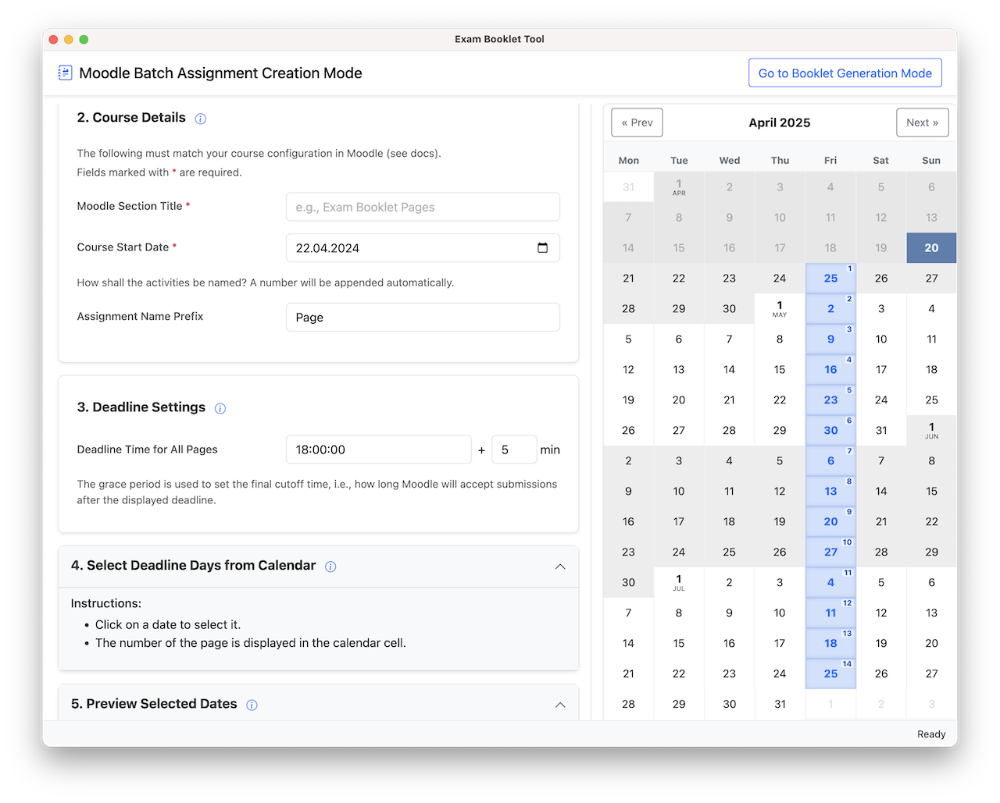
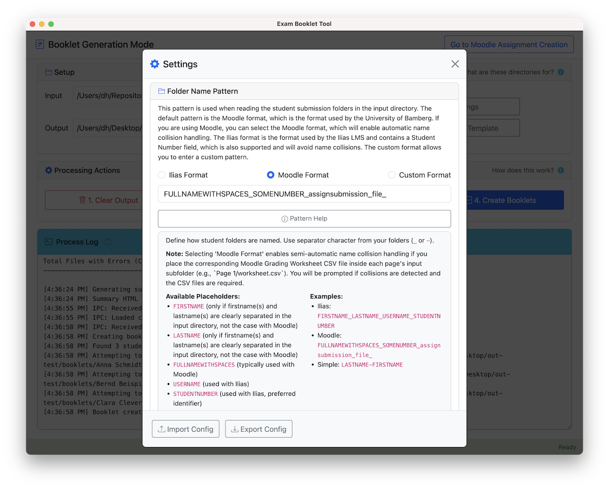

# Booklet Tool: Anleitung für Lehrende

<details>
<summary>Inhaltsverzeichnis</summary>

* [Zweck und Überblick](#1-zweck-und-überblick)
* [Voraussetzungen](#2-voraussetzungen)
* [Schritt-für-Schritt Workflow](#3-schritt-für-schritt-workflow)
  * [Ansätze zur Einrichtung von Aufgaben](#schritt-30-verständnis-der-zwei-ansätze-zur-einrichtung-von-booklet-aufgaben)
  * [Erste Moodle-Kurs-Einrichtung](#schritt-31-erste-moodle-kurs-einrichtung-einmal-pro-kurs)
  * [Moodle-Aufgaben generieren](#schritt-32-moodle-aufgaben-mit-dem-booklet-tool-generieren)
  * [Aufgaben importieren](#schritt-33-aufgaben-in-moodle-importieren)
  * [Studierende anleiten](#schritt-34-ihre-studierenden-anleiten)
  * [Studentische Abgaben herunterladen](#schritt-35-studentische-abgaben-herunterladen)
  * [Finale Booklets erstellen](#schritt-36-die-finalen-booklets-erstellen)
* [Wichtige Hinweise](#4-wichtige-hinweise)
* [Umgang mit identischen Studierendennamen](#5-umgang-mit-identischen-studierendennamen)

</details>

**Wichtiger Hinweis:** Diese Anleitung beschreibt den Workflow speziell für die Moodle-Installation, wie sie an der **Universität Bamberg** konfiguriert ist. Während die allgemeinen Prinzipien auch anderswo anwendbar sein könnten, können Details in anderen Moodle-Installationen erheblich abweichen. **Getestet mit:** Moodle 4.5.

Für die **Ilias**-Lernplattform ist der gesamte Prozess zum Sammeln von Seiten und Generieren von Booklets ähnlich, es fehlt jedoch derzeit der hier beschriebene automatisierte Workflow zur Erstellung von Aufgaben.

## 1. Zweck und Überblick

Diese Anleitung erklärt, wie man Studierendenabgaben für mehrseitige "Booklets" mit Moodle einrichtet und verwaltet. Das *Booklet Tool* unterstützt Lehrende dabei, das "Klausur-Booklet"-Anreizsystem umzusetzen, wie es unter [www.uni-bamberg.de/psi/teaching/booklet-tool/](https://www.uni-bamberg.de/psi/teaching/booklet-tool/) beschrieben wird.

**Das zugrundeliegende Problem:** Es kann schwierig sein, Studierende zu ermutigen, sich durch regelmäßiges Notizenmachen aktiv mit dem Kursmaterial auseinanderzusetzen. Traditionelle Methoden bieten möglicherweise nicht genügend Anreize oder Struktur.

**Lösung mit dem Klausur-Booklet-Anreizsystem:** Dieses System ermöglicht es Lehrenden, Moodle-Aufgaben einzurichten, um während des gesamten Semesters einzelne Booklet-Seiten von Studierenden zu sammeln. Am Ende können Sie (der/die Lehrende) alle eingereichten Seiten pro Studierendem einfach herunterladen und die *Booklet Tool* Desktop-Anwendung verwenden, um diese Seiten zu einem einzigen, druckbaren A5-Booklet für jeden Studierenden zusammenzustellen. Diese Booklets können dann als personalisierte Lernhilfen dienen, die – falls von Ihnen freigegeben gewünscht – auch während der Prüfung verwendet werden können.

**Workflow-Zusammenfassung:**

1. **Ersteinrichtung (einmal pro Kurs):** Erstellen Sie in Ihrem Moodle-Kurs einen eigenen Abschnitt für die Booklet-Aufgaben, z.B. mit dem Titel "Klausur-Booklet".
2. **Aufgaben generieren:** Die Seiten sind zu bestimmten Fristen während des Semesters fällig. Für jede Seite verwenden wir eine Moodle-"Aufgabe", die so konfiguriert wird, dass Studierende eine einzelne Bild- oder PDF-Datei bis zu einer bestimmten Frist hochladen können. Mit dem Booklet Tool können Sie die Erstellung dieser einzelnen Aufgaben automatisieren (z.B. 14 Aufgaben, eine pro Woche in einem 14-wöchigen Semester). Das Tool erstellt dazu eine Moodle-Backup-Datei (`.mbz`), die alle einzelnen Seitenaufgaben mit spezifischen Fristen enthält.
3. **In Moodle importieren:** Stellen Sie die generierte `.mbz`-Datei in Ihrem Moodle-Kurs wieder her, um die Aufgaben zu dem Abschnitt (z.B. "Klausur-Booklet") hinzuzufügen, den Sie in Schritt 1 erstellt haben.
4. **Studierende anleiten:** Geben Sie klare Richtlinien zu Inhalt, Format (z.B. nur handschriftlich), technischen Details (PDF, JPG, PNG; Studierende sollten Bilder auf ihrem Smartphone vor dem Hochladen drehen und zuschneiden) und wie jede Seite bei der richtigen Moodle-Aufgabe einzureichen ist.
5. **Abgaben herunterladen:** Nach Ablauf der Fristen laden Sie alle eingereichten Dateien von jeder Aufgabe mit der Moodle-Funktion "Alle Abgaben herunterladen" herunter. Sie erhalten eine ZIP-Datei pro Frist.
6. **Booklets generieren:** Mit dem *Booklet Tool* verarbeiten Sie den Ordner mit allen heruntergeladenen Abgaben, um die endgültigen druckbaren A5-Booklets zu erstellen.

## 2. Voraussetzungen

Um dieses Tool zu verwenden, benötigen Sie Moderator- bzw. Bearbeitungsberechtigungen im gewünschten Moodle-Kurs.

## 3. Schritt-für-Schritt Workflow

### Vorab: Überblick über die zwei Ansätze zur Einrichtung von Booklet-Aufgaben

Es gibt zwei Möglichkeiten, die Aufgabenaktivitäten für die Booklet-Seiten-Abgaben in Moodle einzurichten:

#### Manueller Ansatz

Sie können die Aufgabenaktivitäten manuell in Moodle erstellen:

1. **Eine Vorlagenaufgabe erstellen und konfigurieren:**
   * Schalten Sie in Ihrem Moodle-Kurs die Bearbeitung ein
   * Fügen Sie Ihrem Booklet-Abschnitt eine neue Aufgabenaktivität hinzu
   * Konfigurieren Sie sie mit diesen empfohlenen Einstellungen:
     * Akzeptierte Dateitypen auf: `jpg,jpeg,png,pdf` setzen
     * Abgaben auf 1 Datei beschränken
     * Maximale Dateigröße festlegen (z.B. 20 MB)
     * Angemessene Zeitpunkte für Fälligkeitsdatum, Letzte Abgabemöglichkeit und Abgabebeginn festlegen
     * **Wichtig:** "Offline-Bewertungstabelle" und "Feedbackdateien" im Abschnitt Feedback-Typen aktivieren
     * Weitere Einstellungen nach Bedarf für Ihren Kurs konfigurieren
   * Aufgabe speichern

2. **Duplizieren und anpassen:**
   * Bei eingeschalteter Bearbeitung die Option "Duplizieren" für Ihre Vorlagenaufgabe finden
   * So oft wie nötig duplizieren (z.B. 14 Mal für ein 14-wöchiges Semester)
   * Für jedes Duplikat:
     * Den Namen bearbeiten, um eine fortlaufende Nummer einzufügen (z.B. "Seite 1", "Seite 2" usw.)
     * Die Fälligkeitsdaten entsprechend anpassen
     * Änderungen speichern

Obwohl dieser Ansatz funktioniert, erfordert er viele Klicks und kann zeitaufwändig und fehleranfällig sein, besonders bei der Anpassung mehrerer Fristen.

#### Automatisierter Ansatz (Empfohlen)

Die folgende Anleitung beschreibt den Prozess des automatisierten Anlegens von Moodle-Aktivitäten mit dem *Booklet Tool*. Dabei werden:

* Eine korrekt formatierte Moodle-Backup-Datei (`.mbz`) mit allen Aufgaben auf einmal erstellt
* Alle Fälligkeits-, Abschneide- und Aktivierungsdaten automatisch festlegt
* Konsistente Benennung und Konfiguration über alle Aufgaben hinweg gewährleistet
* Offline-Bewertungstabellen automatisch aktiviert

**Voraussetzungen für den automatisierten Ansatz:**

* Sie müssen die Berechtigung haben, Kurs-Backups in Ihrem Kurs wiederherzustellen
* Sie müssen einen dedizierten Abschnitt für die Booklet-Seiten-Abgaben in Ihrem Kurs mit einem bestimmten Titel erstellen (Schritt 3.1)
* Sie müssen das Startdatum Ihres Moodle-Kurses kennen, und es ggf. so anpassen, dass es um Mitternacht (00:00) beginnt

Die folgenden Schritte führen Sie durch diesen empfohlenen automatisierten Ansatz.

### Schritt 3.1: Erste Moodle-Kurs-Einrichtung (Einmal pro Kurs)

* Gehen Sie zu Ihrer Moodle-Kursseite.
* Schalten Sie die Bearbeitung ein.
* Fügen Sie einen neuen **Kursabschnitt** hinzu.
* Geben Sie diesem Abschnitt einen klaren, beschreibenden Namen (z.B. "Klausur-Booklet", "Portfolio-Abgaben", "Laborberichte").
* **WICHTIG:** Notieren Sie sich den **exakten Namen** dieses Abschnitts. Sie benötigen ihn genau für das Tool im nächsten Schritt.
* **WICHTIG:** Beachten Sie das **Kursstartdatum** in Ihren Moodle-Kurseinstellungen. Sie benötigen dieses exakte Datum für das Booklet Tool im nächsten Schritt. Damit die automatisch erzeugten Aufgaben mit den richtigen Fristen angezeigt werden, stellen Sie sicher, dass Ihr Moodle-Kursstartdatum auf **00:00 (Mitternacht)** des ausgewählten Tages gesetzt ist. Wenn Ihr Kurs eine andere Startzeit verwendet, werden die Aufgabenfristen möglicherweise nicht korrekt ausgerichtet.

### Schritt 3.2: Moodle-Aufgaben mit dem Booklet Tool generieren

Klicken Sie im Booklet Tool auf die Schaltfläche **Go to Moodle Assignment Creation** in der oberen rechten Ecke. Geben Sie die angeforderten Informationen ein und erstellen Sie die MBZ-Backup-Datei für Moodle. Speichern Sie diese auf Ihrem Gerät.

> Momentan gibt es einige [Einschränkungen](https://github.com/UBA-PSI/klausur-booklets?tab=readme-ov-file#known-limitations) beim automatischen Anlegen von Aktivitäten.



### Schritt 3.3: Aufgaben in Moodle importieren

Laden Sie die vom Tool generierte `.mbz`-Datei in Ihren Moodle-Kurs hoch.

* Gehen Sie in Ihrem Moodle-Kurs zu "Kursverwaltung" (oft ein Zahnradsymbol ⚙️) > "Wiederherstellen".
  * Stellen Sie sicher, dass Sie auf der Hauptseite des Kurses sind, also nicht gerade eine Aktivität bearbeiten.
  * An der Universität Bamberg (VC): Klicken Sie in einem Kurs auf **Mehr** im oberen Kursmenü, dann auf auf **Kurs wiederverwenden**. Klicken Sie dann auf **Wiederherstellen**.
* Laden Sie die in Schritt 3.2 erstellte `.mbz`-Backup-Datei hoch (z.B. `WI24_Booklets.mbz`), indem sie sie in das Feld Sicherhungsdatei ziehen.
* Folgen Sie den Moodle-Wiederherstellungsaufforderungen sorgfältig:
  * **Ziel:** Wählen Sie "In diesen Kurs wiederherstellen".
  * **Importtyp:** Wählen Sie **"Den gesicherten Kurs mit einem bestehenden Kurs verschmelzen"**. Dies ist entscheidend, um die Aufgaben hinzuzufügen, ohne bestehende Inhalte zu löschen.
  * **Einstellungen:** Stellen Sie sicher, dass "Aktivitäten und Materialien einbeziehen" aktiviert ist (normalerweise ist es das von vornherein, sodass nichts zu tun ist). Überprüfen Sie andere Einstellungen nach Bedarf (in der Regel sind keine weiteren Änderungen erforderlich, folgen Sie dem Workflow bis zum Start der Wiederherstellung).
  * **Vorschau:** Sie sehen die Aufgaben, die dem Kurs hinzugefügt werden sollen, und den Namen des Abschnitts, den Sie dem Tool angegeben haben.
  * Fahren Sie mit der Bestätigung fort und führen Sie die Wiederherstellung durch.
* **Überprüfen:** Gehen Sie zu dem von Ihnen angegebenen Kursabschnitt (z.B. "Klausur-Booklet"). Sie sollten jetzt alle Aufgaben ("Booklet Seite 1" usw.) mit den richtigen Namen und Fälligkeitsdaten sehen.

### Schritt 3.4: Ihre Studierenden anleiten

Klare Anweisungen sind unerlässlich für den Erfolg der Studierenden und um sicherzustellen, dass das Booklet Tool die Dateien korrekt verarbeiten kann.

Wir empfehlen:

1. Fügen Sie eine Seite oder Beschriftung mit dem Titel **"Wie Sie Ihre wöchentliche Booklet-Seite erstellen"** hinzu und fügen Sie den Inhalt des [Studierendenleitfadens](student-guide-de.md) ein (oder verlinken Sie auf die Webkopie).
2. Erwähnen Sie den Leitfaden in Ihrer ersten Vorlesung und in der Ankündigung, die die erste Aufgabe eröffnet.
3. Wenn Sie die Anzahl der Seiten, akzeptierte Dateitypen oder eine Formatierungsregel ändern, passen Sie den Studierendenleitfaden entsprechend an, bevor der Kurs beginnt.

Die im Studierendenleitfaden genannten Formatanforderungen entsprechen den Regeln, die typischerweise am PSI-Lehrstuhl verwendet werden – passen Sie diese gerne an Ihr pädagogisches Konzept an.

### Schritt 3.5: Studentische Abgaben herunterladen

Nach Ablauf der Fristen (oder jederzeit während des Semesters für eine Vorschau):

* Navigieren Sie zur ersten Booklet-Seitenaufgabe in Moodle (z.B. "Booklet Seite 1").
* Klicken Sie auf **Einreichungen** bzw. auf **Alle Abgaben anzeigen**.
* Verwenden Sie den Menü-Button **Aktionen** und wählen Sie **"Alle Abgaben herunterladen"**. Moodle erstellt eine ZIP-Datei.
* Laden Sie die ZIP-Datei herunter und **entpacken** Sie sie.
* **Wiederholen Sie diesen Download-Prozess für JEDE Aktivität.**
* **WICHTIG:** Erstellen Sie einen **einzelnen Ordner** auf Ihrem Computer, etwa **booklet-submissions**. Verschieben Sie **alle** ausgepackten Ordner mit den extrahierten Studierendenabgabedateien von *allen* Aufgaben in diesen einen Ordner.
* Die resultierende Struktur sollte so aussehen:

```
booklet-submissions/
├── Seite 1/
│   ├── Bernd Beispiel_44441_assignsubmission_file_/
│   │   └── page1.png
│   └── Clara Clever_55551_assignsubmission_file_/
│       └── seite1.pdf
├── Seite 2/
│   ├── Anna Schmidt_11112_assignsubmission_file_/
│   │   └── IMG_13120.jpg
│   ├── Bernd Beispiel_44442_assignsubmission_file_/
│   │   └── pic.png
│   └── Clara Clever_55552_assignsubmission_file_/
│       └── Scan.jpeg
└── Seite 3/
    ├── Anna Schmidt_11113_assignsubmission_file_/
    │   └── IMG_13941.jpg
    └── Clara Clever_55553_assignsubmission_file_/
        └── dummy.png
```

### Schritt 3.6: Die finalen Booklets erstellen

* Starten Sie das **Booklet Tool**.
* Befolgen Sie die folgenden Anweisungen:
  * Den gerade vorbereiteten Ordner **booklet-submissions** auswählen, der alle heruntergeladenen Studierendenabgaben enthält (aus Schritt 3.5).
  * Ausgabeoptionen konfigurieren (z.B. Deckblatt, dpi, Dateigrößen).
  * Den dreistufigen Generierungsprozess ausführen:
    1. **Convert to PDFs:** Das Tool verarbeitet jede eingereichte Datei (PDF, JPG, PNG, HEIC) in eine standardisierte A5-PDF-Seite. Bilder werden bei Bedarf gedreht. **Ambiguity Detection:** Wenn ein Studierendenabgabeordner (z.B. `Clara Clever_55551_assignsubmission_file_`) mehrere gültige Dateien enthält, pausiert das Tool und fordert Sie auf, auszuwählen, welche spezifische Datei für diese Seite in das endgültige Booklet aufgenommen werden soll.
    2. **Merge PDFs:** Deckblätter werden generiert und die konvertierten A5-Seiten werden in aufsteigender Reihenfolge zu je einem PDF für jeden Studierenden zusammengeführt.
    3. **Booklets erstellen:** Die einzelnen A5-Seiten werden paarweise auf A4-Seiten angeordnet so dass sie bei doppelseitigem Druck ("Binden an kurzer Seite") zu einem Booklet zusammengeheftet werden können.
* **Ausgabeort:** Die endgültigen druckbaren Booklets (`<StudentIdentifier>.pdf`) werden in einem `booklets` Unterordner relativ zu Ihrem Ausgabeverzeichnis platziert. Zwischendateien (konvertierte A5-Seiten, zusammengeführte PDFs) werden nach den jeweiligen Schritten in Unterordnern `pages` und `pdfs` innerhalb des Ausgabeverzeichnisses gespeichert.
* **Zusammenfassungsbericht:** Das Tool generiert auch eine HTML-Datei mit dem Namen `summary.html` im Ausgabeverzeichnis. Diese Datei bietet einen praktischen Überblick:
  * Listet alle gefundenen Studierenden auf.
  * Zeigt die Anzahl der erfolgreich eingereichten Seiten pro Studierendem.
  * Enthält zusammenfassende Statistiken (Gesamtzahl Studierende, Gesamtzahl Seiten).
  * Zeigt die Verteilung der Seitenzahlen über die Studierenden hinweg.
  * Gibt an, ob Dateien übersprungen wurden oder bei der Verarbeitung Fehler aufgetreten sind.

  Beispielstruktur:
  ```html
  <!-- Ausschnitt aus summary_report.html -->
  <h1>Zusammenfassung der Studierendenabgaben</h1>
  <table>
    <thead>
      <tr>
        <th>Last Name</th>
        <th>First Name</th>
        <th>Student ID</th>
        <th>Submitted Pages</th>
        <th>Skipped Files</th>
        <th>Files with Errors</th>
      </tr>
    </thead>
    <tbody>
      <tr><td>Beispiel</td><td>Bernd</td><td></td><td>3</td><td></td><td></td></tr>
      <tr><td>Clever</td><td>Clara</td><td></td><td>3</td><td></td><td></td></tr>
      <!-- ... mehr Studierende ... -->
    </tbody>
  </table>
  <!-- ... zusammenfassende Statistiken ... -->
  ```

<table>
<tr>
  <td></td>
  <td></td>
  <td></td>
</tr>
<tr>
  <td align="center"><sub>Settings Editor</sub></td>
  <td align="center"><sub>Cover Template Editor</sub></td>
  <td align="center"><sub>Resultierende A5 Booklets</sub></td>
</tr>
</table>

## 4. Wichtige Hinweise

* **Das Tool erstellt Dateien, ändert Moodle nicht direkt:** Das Booklet Tool *generiert* nur eine `.mbz`-Datei. Sie *müssen* immer die Moodle-Funktion "Wiederherstellen" (Schritt 3.3) verwenden, um die Aufgaben in Ihren Kurs zu bekommen.
* **Verwenden Sie die RICHTIGE `.mbz` Datei:** Importieren Sie nur die vom Tool *erstellte* Datei (z.B. `WI24_Booklets.mbz`) in Moodle.
* **Exakte Abschnittstitel-Übereinstimmung:** Der im Tool verwendete Abschnittstitel muss *exakt* mit dem in Schritt 3.1 erstellten Moodle-Abschnittsnamen übereinstimmen, damit der Import korrekt funktioniert.
* **Zielstartdatum:** Das Kursstartdatum muss genau mit dem Startdatum Ihres Moodle-Kurses übereinstimmen. Dies ist entscheidend dafür, dass die Aufgabenfristen während des Imports korrekt erhalten bleiben.
* **Mitternachtsstartzeit:** Ihr Moodle-Kurs sollte so konfiguriert sein, dass er um 00:00 (Mitternacht) des Datums startet, das Sie im Booklet Tool angeben. Wenn Ihr Kurs eine andere Startzeit verwendet, müssen Sie möglicherweise Ihre Aufgabenfristen nach dem Import anpassen.
* **Moodle-Backups:** Erwägen Sie, ein Standard-Moodle-Backup Ihres Kurses *vor* der Wiederherstellung der Aufgaben zu erstellen – als Sicherheitsmaßnahme, falls der Import nicht wie gewünscht funktionieren sollte.
* **Offline-Feedback:** Die generierten Aufgaben sind so konfiguriert, dass sie das Herunterladen von Bewertungstabellenn (CSV-Dateien) ermöglichen, falls dies für Offline-Bewertungsworkflows benötigt wird. Diese Dateien werden für die Booklet-Generierung benötigt, wenn es Studierende mit identischem Namen gibt.

---

## 5. Umgang mit identischen Studierendennamen

Eine Komplikation sind mehrere Studierende in Ihrem Moodle-Kurs mit exakt gleichem vollständigen Namen. Die Standardordnernamen, die beim Herunterladen von Abgaben erstellt werden (z.B. `Anna Schmidt_11112_assignsubmission_file_`), enthalten den Namen des Studierenden und eine Nummer. **Entscheidend ist, dass diese Nummer die spezifische *Abgabe* identifiziert, nicht den Studierenden.** Der gleiche Studierende wird über verschiedene Aufgaben hinweg *unterschiedliche* Abgabe-ID-Nummern haben.

Daher ist es unzureichend, sich ausschließlich auf den Ordnernamen zu verlassen, um zwischen zwei Studierenden namens "Anna Schmidt" zu unterscheiden. Um dies zu lösen, verwendet das **Booklet Tool** Moodles **Bewertungstabellen**.

* **Erkennung:** Wenn das Booklet Tool identische Namen innerhalb eines Abgabeordners erkennt, kann es die Seiten nicht zuverlässig gruppieren.
* **Anforderung:** Das Tool wird Sie anweisen, die **Bewertungstabelle (CSV-Datei)** für *jede* Booklet-Seitenaufgabe herunterzuladen. Diese können über das Menü "Aktionen" auf der Seite "Alle Abgaben anzeigen" bzw. "Einreichungen" in Moodle für jede Aufgabenaktivität heruntergeladen werden.
* **Lösung:** Platzieren Sie diese heruntergeladenen CSV-Dateien neben den Studierendenabgabedateien. Die CSV-Datei enthält mehrere Spalten, einschließlich der **Abgabe-ID** (die mit der Nummer im Ordnernamen übereinstimmt) und der **E-Mail-Adresse des Studierenden**. Da E-Mail-Adressen innerhalb von Moodle eindeutige Identifikatoren sind, verwendet das Booklet Tool die CSVs, um jede Abgabe-ID (und damit jede eingereichte Datei) über die E-Mail-Adresse einem eindeutigen Studierenden zuzuordnen.
* **Notwendigkeit:** Dieser Prozess des Herunterladens und Bereitstellens der Bewertungstabellen ist **nur erforderlich, wenn Sie Studierende mit identischen Namen** in Ihrem Kurs haben. Wenn alle Studierendennamen eindeutig sind, kann das Booklet Tool die Seiten typischerweise ohne die CSV-Dateien korrekt gruppieren.

## Schlussbemerkung

Diese Anleitung beschreibt den allgemeinen Workflow für die Verwendung des Moodle-Booklet-Systems. Denken Sie daran, alle kursspezifischen Details (wie Prüfungsregeln bezüglich des Booklets) anzupassen und sich für den spezifischen Betrieb auf die eigene Dokumentation des Booklet Tools zu beziehen.