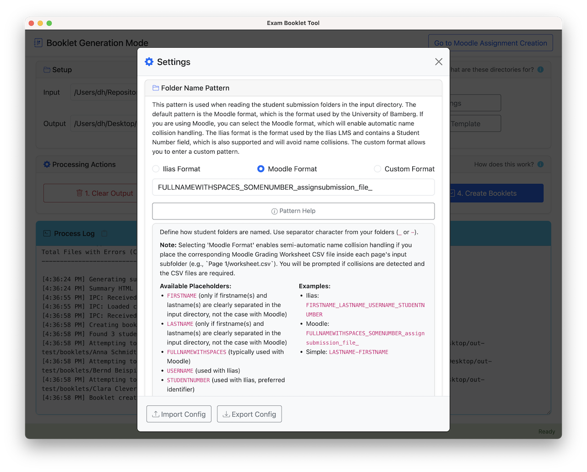
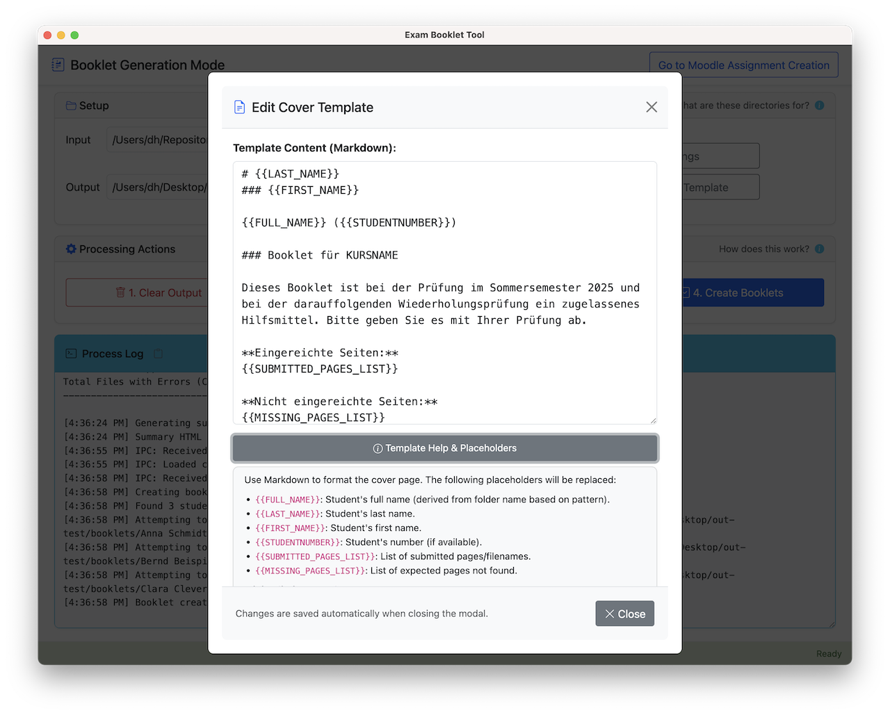

# Booklet Tool: Instructor Guide

<details>
<summary>Table of Contents</summary>

* [Purpose and Overview](#1-purpose-and-overview)
* [Prerequisites](#2-prerequisites)
* [Step‑by‑Step Workflow](#3-step-by-step-workflow)
  * [Approaches to Setting Up Assignments](#step-30-understanding-the-two-approaches-to-setting-up-booklet-assignments)
  * [Initial Moodle Course Setup](#step-31-initial-moodle-course-setup-once-per-course)
  * [Prepare and Modify Assignments](#step-32-prepare-and-modify-assignments-with-the-booklet-tool)
  * [Import Assignments](#step-33-import-assignments-into-moodle)
  * [Instruct Your Students](#step-34-instruct-your-students)
  * [Download Student Submissions](#step-35-download-student-submissions)
  * [Generate the Final Booklets](#step-36-generate-the-final-booklets)
* [Important Reminders](#4-important-reminders)
* [Handling Identical Student Names](#5-handling-identical-student-names)
* [Final Remarks](#6-final-remarks)

</details>

**Important Note:** This guide describes the workflow specifically for the Moodle instance as configured at the **University of Bamberg**. While the general principles might apply elsewhere, details may differ significantly in other Moodle installations. **Tested with:** Moodle 4.5.

## 1. Purpose and Overview

This guide explains how to set up and manage student submissions for multi-page "Booklets" using Moodle. The *Booklet Tool* helps instructors implement the "Klausur-Booklet" incentive system as described at [psi.uni-bamberg.de/en/lehre/booklet/](https://psi.uni-bamberg.de/en/lehre/booklet/).

**The Underlying Problem:** Encouraging students to engage actively with course material through regular note-taking can be challenging. Traditional methods might not provide enough incentive or structure.

**Solution with the Klausur-Booklet Incentive System:** This system allows instructors to set up Moodle assignments to collect individual booklet pages from students throughout the semester. At the end, you (the instructor) can easily download all submitted pages per student and use the *Booklet Tool* desktop application to compile these pages into a single, printable A5 booklet for each student. These booklets can then serve as personalized learning aids, potentially even for use during exams (if permitted by your course rules).

**Workflow Summary:**

1.  **Initial Setup (Once per Course):** Create a dedicated section in your Moodle course for the booklet assignments, e.g., titled `"Exam Booklet"`.
2.  **Prepare and Modify Assignments:** Pages are due at certain deadlines during the semester. For every page, we use one Moodle "Assignment" Activity that will be configured to allow students to upload a single image or PDF file up to a certain deadline. You first prepare a set of template assignments in Moodle, export them as a backup (`.mbz`), then use the *Booklet Tool*'s MBZ Modifier to set all deadlines, names, and timing options at once.
3.  **Import into Moodle:** Restore the modified `.mbz` file into your Moodle course to add the assignments to the dedicated section (e.g., `"Exam Booklet"`) you created in Step 1.
4.  **Instruct Students:** Provide clear guidelines on content, format (e.g., strictly only handwritten), technical details (PDF, JPG, PNG; students should rotate and crop images on their smartphone before uploading) and how to submit each page to the correct Moodle assignment.
5.  **Download Submissions:** After deadlines pass, download all submitted files from each assignment using Moodle's "Download all submissions" feature. You will get one ZIP file per deadline.
6.  **Generate Booklets:** Use the *Booklet Tool*, feeding it the folder containing all downloaded submissions to create the final printable A5 booklets.

## 2. Prerequisites

To use this tool, ensure you have teacher or editing permissions in the target Moodle course.

## 3. Step-by-Step Workflow

### Understanding the Two Approaches to Setting Up Booklet Assignments

There are two ways to set up the multiple assignment activities needed for booklet page submissions in Moodle:

#### Manual Approach

You can create the assignment activities manually in Moodle:

1. **Create and Configure One Template Assignment:**
   * In your Moodle course, turn on editing
   * Add a new Assignment activity to your booklet section
   * Configure it with these recommended settings:
     * Set allowed file types to: `jpg,jpeg,png,pdf`
     * **Limit submissions to 1 file** (each assignment collects exactly one page)
     * Set maximum file size (e.g., 20 MB)
     * Set appropriate due date, cutoff date, and activation date
     * **Important:** Enable "Offline grading worksheet" and "Feedback files" in the Feedback types section
     * Configure other settings as needed for your course
   * Save the assignment

2. **Duplicate and Modify:**
   * With editing on, locate the "Duplicate" option for your template assignment
   * Duplicate it as many times as needed (e.g., 14 times for a 14-week semester)
   * For each duplicate:
     * Edit the name to include an incremented number (e.g., "Page 1", "Page 2", etc.)
     * Adjust the due dates appropriately
     * Save changes

While this approach works, it involves a lot of clicking and can be error-prone, especially when adjusting multiple deadlines. The automated approach below avoids this.

#### Automated Approach (Recommended)

The following guide focuses on the automated approach using the *Booklet Tool*'s MBZ Modifier, which:

* Takes an existing Moodle backup (`.mbz`) and lets you modify all assignment deadlines, names, and timing at once
* Supports two open modes: **Chain** (each assignment opens when the previous one closes) and **Fixed** (each opens a set number of days before its deadline)
* Configurable grace period between due time and cutoff
* Shows a live timestamp preview before saving
* Provides a "Rename All" feature to apply a prefix with incrementing numbers (e.g., "Page 1", "Page 2", ...)

**Prerequisites for the automated approach:**

* You must have permission to restore course backups in your Moodle instance
* You need a Moodle backup (`.mbz`) file containing template assignments — either from a previous semester or created manually (see Step 3.2)
* If importing into a different course, you need to know the target course's start date

We recommend testing the workflow in a test course first, but it works reliably in practice.

### Step 3.1: Initial Moodle Course Setup (Once per Course)

*   Go to your Moodle course page.
*   Turn Editing On.
*   Add a new **Course Section** and give it a descriptive name (e.g., `"Exam Booklet"`, `"Portfolio Submissions"`, `"Lab Reports"`). When using the automated approach, the exact name does not matter — the MBZ import will create or overwrite the section name from the backup.
*   **IMPORTANT:** Note the **Course Start Date** in your Moodle course settings. You will need this exact date for the *Booklet Tool* in the next step. For the assignments to appear with the correct deadlines, ensure your Moodle course start date is set to **00:00 (midnight)** of the selected day. If your course uses a different start time, the assignment deadlines may not align correctly.

### Step 3.2: Prepare and Modify Assignments with the Booklet Tool

#### Preparing the Template MBZ

You need a Moodle backup (`.mbz`) file that already contains assignment activities. Two options:

* **From a previous semester:** If you used booklet assignments before, export the relevant course section as a backup from Moodle (Course administration → Backup → select only the booklet section).
* **First-time setup:**
  1. Create one assignment activity in Moodle and configure it with the correct settings:
     * Set allowed file types to: `jpg,jpeg,png,pdf`
     * **Limit submissions to 1 file** (each assignment collects exactly one page)
     * Set maximum file size (e.g., 20 MB)
     * Enable "Offline grading worksheet" and "Feedback files" in the Feedback types section
  2. Duplicate this assignment as many times as needed (e.g., 14 times for a 14-week semester). Moodle will append "(copy)" to each duplicate — that is fine, since the MBZ Modifier will rename them all in one step anyway.
  3. Export only the booklet section as a Moodle backup (`.mbz`). You do not need to set proper names or deadlines for the duplicates — the MBZ Modifier handles that.

  You only need to do this once. You can reuse and modify this template `.mbz` file each semester.

#### Using the MBZ Modifier

1. In the *Booklet Tool*, click **Go to MBZ Modifier** in the top right corner.
2. Click **Select MBZ File** and open your template `.mbz` file. The tool discovers all assignments and displays them in an editable table.
3. **Set deadlines:** Click a row to select an assignment, then click a date in the calendar on the right. The tool auto-advances to the next assignment. You can also type dates and times directly in the table.
4. **Rename assignments:** Enter a prefix (e.g., "Page") and click **Rename All** to apply "Page 1", "Page 2", etc.
5. **Configure timing:** Set the deadline time (e.g., 17:00), grace period (minutes between due and cutoff), and open mode:
   * **Chain:** Each assignment opens when the previous one's cutoff passes. The first one opens a set number of days before its deadline.
   * **Fixed:** Every assignment opens independently, a set number of days before its own deadline.
6. **Preview:** Expand the **Timestamp Preview** section to verify all computed open/close/cutoff timestamps before saving.
7. **Advanced Settings:** If importing into a different course, set the **Course Start Date** to match the target course — this prevents Moodle from shifting deadlines during import.
8. Click **Save Modified MBZ** and store the file on your machine.

### Step 3.3: Import Assignments into Moodle

Upload the `.mbz` file saved by the MBZ Modifier into your Moodle course.

*   In your Moodle course, go to "Course administration" (often a gear icon ⚙️) > "Restore".
    *   Ensure you are on the main course page, not editing an activity.
    *   At University of Bamberg (VC): In a course, click on **More** in the course's top menu, then click on **Course reuse**. Then click on **Restore**.
*   Upload the `.mbz` backup file created in Step 3.2 (e.g., `WI24_Booklets.mbz`), for example by dragging it into the file upload area.
*   Follow the Moodle restore prompts carefully:
    *   **Destination:** Choose "Restore into this course".
    *   **Import Type:** Select **"Merge the backup course into this course"**. If you choose "Delete contents and then restore" instead, Moodle will remove all existing course content.
    *   **Settings:** Ensure "Include activities and resources" is enabled (this is usually the default). Review other settings as needed (typically no further changes needed, follow the workflow until the Restoration starts).
    *   **Preview:** You will see the assignments that are to be added to the course and the name of the Section you provided to the tool.
    *   Proceed through the confirmation and perform the restore.
*   **Verify:** Go to the course section you specified (e.g., `"Exam Booklet"`). You should now see all the assignments ("Booklet Page 1", etc.) listed with the correct names and due dates.

### Step 3.4: Instruct Your Students

Clear instructions are essential for student success and to ensure the *Booklet Tool* can process the files correctly.

We recommend:

1. Add a page or label titled **"How to create your weekly booklet page"** and paste the contents of the [Student Guide](student-guide.md) there (or link to its web copy).
2. Mention the guide in your first lecture and in the announcement that opens the first assignment.
3. If you change the number of pages, accepted file types, or any formatting rule, adjust the Student Guide accordingly before class starts.

The format requirements mentioned in the Student Guide correspond to the rules typically used at the PSI Chair – feel free to adapt to fit your pedagogical concept).


### Step 3.5: Download Student Submissions

#### For Moodle Users

After the deadlines (or any time during the semester for a preview) have passed:

*   Navigate to the first booklet page assignment in Moodle (e.g., "Booklet Page 1").
*   Click **"View all submissions"** or **"Submissions"**.
*   Use the **"Grading action"** menu and select **"Download all submissions"**. Moodle will create a ZIP file.
*   Download and **extract** the ZIP file.
*   **Repeat this download process for EVERY assignment activity.**
*   **CRITICAL:** Create a **single, dedicated folder** on your computer, e.g., `booklet-submissions`. Move **all** the extracted folders containing student submission files (from *all* assignments) into this one folder.
*   The resulting structure should look like this:

```
booklet-submissions/
├── Seite 1/
│   ├── Bernd Beispiel_44441_assignsubmission_file_/
│   │   └── page1.png
│   └── Clara Clever_55551_assignsubmission_file_/
│       └── seite1.pdf
├── Seite 2/
│   ├── Anna Schmidt_11112_assignsubmission_file_/
│   │   └── IMG_13120.jpg
│   ├── Bernd Beispiel_44442_assignsubmission_file_/
│   │   └── pic.png
│   └── Clara Clever_55552_assignsubmission_file_/
│       └── Scan.jpeg
└── Seite 3/
    ├── Anna Schmidt_11113_assignsubmission_file_/
    │   └── IMG_13941.jpg
    └── Clara Clever_55553_assignsubmission_file_/
        └── dummy.png
```

#### For ILIAS Users

The download process is similar, but with one important difference: **do not extract the ZIP files**.

ILIAS offers two download formats:

1. **Per-Assignment Download** (recommended when you have fewer exercises than students)
   * Download one ZIP per exercise containing all students' submissions
   * Example: 3 exercises with 50 students → download 3 ZIP files

2. **Per-Student Download** (recommended when you have fewer students than exercises)
   * Download one ZIP per student containing all their exercises
   * Example: 10 students with 20 exercises → download 10 ZIP files

**Usage:** Create a dedicated folder (e.g., `booklet-submissions`) and place all downloaded ZIP files there **without extracting them**. The Booklet Tool automatically detects the ILIAS format and processes the files.


### Step 3.6: Generate the Final Booklets

*   Launch the ***Booklet Tool*** application.
*   Follow its instructions:
    *   Select the single **`booklet-submissions`** folder containing all the downloaded student submissions (from Step 3.5).
    *   Configure output options (e.g., cover page, dpi, file sizes).
    *   **Name Detection (Moodle only):** Open Settings and check the *Name Detection* card. Three modes are available:
        *   **Automatic** (default): Uses Grading Worksheet CSV columns if available, then email-based heuristics, then falls back to last-word-is-last-name.
        *   **Registration list**: Provide a CSV with separate first name / last name columns (e.g., exported from your university's registration system). The tool auto-detects semicolon and comma delimiters and shows a validation result immediately after selecting the file.
        *   **Heuristic only**: Always uses the last word of the folder name as the last name.
    *   Run the three-step generation process:
        1.  **Convert to PDFs:** The tool processes each submitted file (PDF, JPG, PNG, HEIC) into a standardized A5 PDF page. Images are rotated if necessary. A `sort-order.txt` file is written to the output directory – it controls the print order during merging and can be edited manually before proceeding. **Ambiguity Detection:** If a student submission folder (e.g., `Clara Clever_55551_assignsubmission_file_`) contains multiple valid files, the tool will pause and prompt you to select which specific file should be included in the final booklet for that page.
        2.  **Merge PDFs:** Cover sheets are generated, and the converted A5 pages are merged according to the order in `sort-order.txt` into one PDF per student.
        3.  **Create Booklets:** The individual A5 pages are imposed pairwise onto A4 pages so that they can be stapled into a booklet when printed double-sided (binding on the short edge).
    *   **Refresh sort-order.txt (Moodle, registration-list mode):** If you change the registration list CSV or name detection mode after converting, use the *Refresh sort-order.txt* link below the action buttons to regenerate the sort order from existing data without re-converting pages.
*   **Output Location:** The final printable booklets (`<StudentIdentifier>.pdf`) are placed in a `booklets` subfolder relative to your output directory. Intermediate files (converted A5 pages, merged PDFs) are stored after the respective steps in subfolders `pages` and `pdfs` within the output directory.
*   **Summary Report:** The tool also generates an HTML file named `summary.html` in the output directory. This file provides a convenient overview:
    *   Lists all students found.
    *   Shows the number of pages successfully submitted by each student.
    *   Includes summary statistics (total students, total pages).
    *   Shows the distribution of page counts across students.
    *   Indicates if any files were skipped or encountered errors during processing.

    Example structure:
    ```html
    <!-- Snippet of summary_report.html -->
    <h1>Student Submission Summary</h1>
    <table>
      <thead>
        <tr>
          <th>Last Name</th>
          <th>First Name</th>
          <th>Student ID</th>
          <th>Submitted Pages</th>
          <th>Skipped Files</th>
          <th>Files with Errors</th>
        </tr>
      </thead>
      <tbody>
        <tr><td>Beispiel</td><td>Bernd</td><td></td><td>3</td><td></td><td></td></tr>
        <tr><td>Clever</td><td>Clara</td><td></td><td>3</td><td></td><td></td></tr>
        <!-- ... more students ... -->
      </tbody>
    </table>
    <!-- ... summary statistics ... -->
    ```

<table>
<tr>
  <td></td>
  <td></td>
  <td></td>
</tr>
<tr>
  <td align="center"><sub>Settings Editor</sub></td>
  <td align="center"><sub>Cover Template Editor</sub></td>
  <td align="center"><sub>Resulting A5 Booklets</sub></td>
</tr>
</table>


## 4. Important Reminders

*   **Tool Modifies Files, Doesn't Change Moodle Directly:** The *Booklet Tool* only *modifies* an `.mbz` file. You *must* always use the Moodle "Restore" function (Step 3.3) to get the assignments into your course.
*   **Use the CORRECT `.mbz` File:** Only import the file *saved by the MBZ Modifier* (e.g., `WI24_Booklets-modified.mbz`) into Moodle.
*   **Section Title:** The section title in the `.mbz` is carried over from the original backup. On import, Moodle creates a new section with this name or merges it with an existing one.
*   **Target Start Date:** When importing into a different course, set the Course Start Date in the MBZ Modifier's Advanced Settings to match the target course. If the dates do not match, Moodle will shift all assignment deadlines during import.
*   **Moodle Backups:** Consider making a standard Moodle backup of your course *before* restoring the assignments, just as a safety measure in case the import does not proceed as expected.
*   **Offline Feedback & Identical Names:** Ensure your template assignments are configured to allow downloading grading worksheets (CSV files). These files are needed by the *Booklet Tool* when you have students with identical full names (see Section 5).


---

## 5. Handling Identical Student Names

A complication arises if multiple students in your Moodle course share the exact same full name. The default folder names created when downloading submissions (e.g., `Anna Schmidt_11112_assignsubmission_file_`) include the student's name and a number. **This number identifies the specific *submission*, not the student.** The same student will have *different* submission ID numbers across different assignments.

Therefore, relying solely on the folder name is insufficient to distinguish between two students named "Anna Schmidt". To resolve this, the *Booklet Tool* utilizes Moodle's **Grading Worksheets**.

*   **Detection:** If the *Booklet Tool* detects identical names among the submission folders for a single assignment, it cannot reliably group pages later on.
*   **Requirement:** The tool will instruct you to download the **Grading Worksheet (CSV file)** for *each* booklet page assignment. These can be downloaded from the "View all submissions" page via the "Action" menu in Moodle for each assignment activity.
*   **Resolution:** Place these downloaded CSV files alongside the student submission folders (e.g., inside the respective folder in your `booklet-submissions` folder). The CSV file contains several columns, including the **submission ID** (matching the number in the folder name) and the **student's email address**. Since email addresses are unique identifiers within Moodle, the *Booklet Tool* uses the CSVs to map each submission ID (and thus each submitted file) back to a unique student via their email address.
*   **Necessity:** This process of downloading and providing the Grading Worksheets is **only required if you have students with identical full names** in your course. If all student names are unique, the *Booklet Tool* can typically group the pages correctly without needing the CSV files.

---

## 6. Final Remarks

Adapt course-specific details (like exam rules regarding the booklet) as needed. For details on specific features, refer to the *Booklet Tool*'s built-in help.