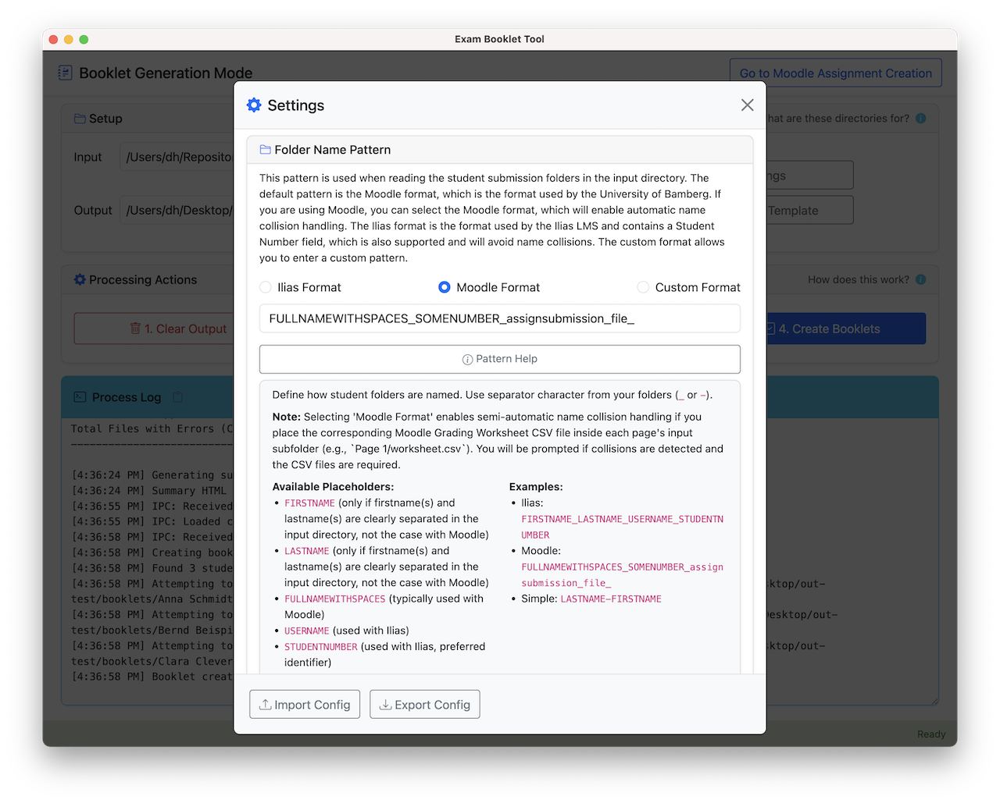
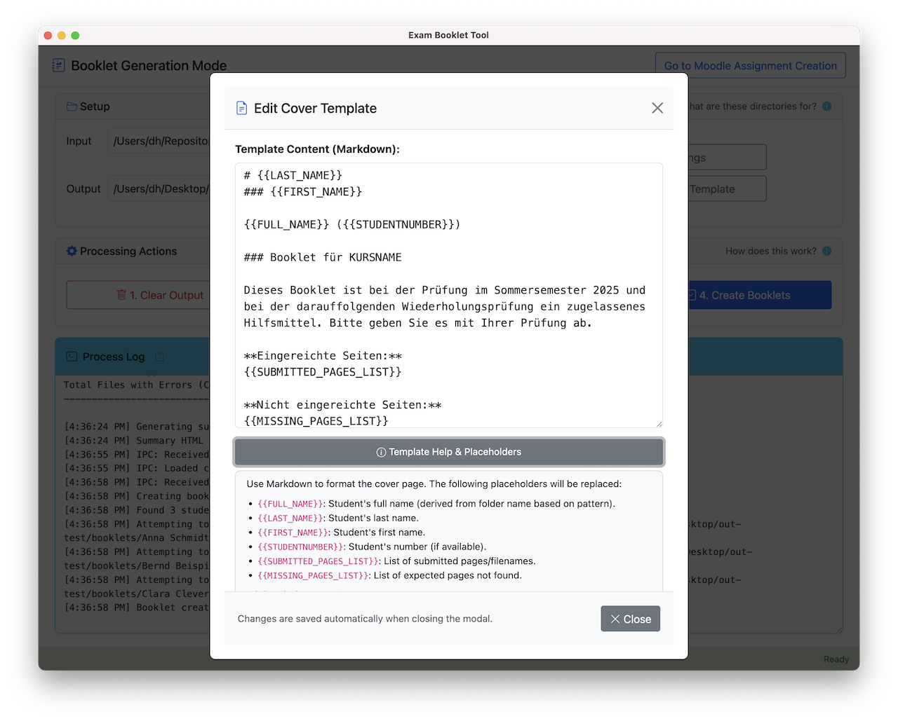

# Booklet Tool: Instructor Guide

<details>
<summary>Table of Contents</summary>

* [Purpose and Overview](#1-purpose-and-overview)
* [Prerequisites](#2-prerequisites)
* [Step‑by‑Step Workflow](#3-step-by-step-workflow)
  * [Create Section and Placeholder Assignments](#step-31-create-the-booklet-section-and-placeholder-assignments-in-moodle)
  * [Export and Modify](#step-32-export-the-section-and-modify-it-with-the-booklet-tool)
  * [Delete Placeholders and Import](#step-33-delete-the-placeholders-and-import-the-assignments-into-moodle)
    * [Alternatives](#alternatives-to-the-recommended-way)
  * [Instruct Your Students](#step-34-instruct-your-students)
  * [Download Student Submissions](#step-35-download-student-submissions)
  * [Generate the Final Booklets](#step-36-generate-the-final-booklets)
* [Important Reminders](#4-important-reminders)
* [Handling Identical Student Names](#5-handling-identical-student-names)
* [Final Remarks](#6-final-remarks)

</details>

**Important Note:** This guide describes the workflow specifically for the Moodle instance as configured at the **University of Bamberg**. While the general principles might apply elsewhere, details may differ significantly in other Moodle installations. **Tested with:** Moodle 4.5.

## 1. Purpose and Overview

This guide explains how to set up and manage student submissions for multi-page "Booklets" using Moodle. The *Booklet Tool* helps instructors implement the "Klausur-Booklet" incentive system as described at [psi.uni-bamberg.de/en/lehre/booklet/](https://psi.uni-bamberg.de/en/lehre/booklet/).

**The Underlying Problem:** Encouraging students to engage actively with course material through regular note-taking can be challenging. Traditional methods might not provide enough incentive or structure.

**Solution with the Klausur-Booklet Incentive System:** This system allows instructors to set up Moodle assignments to collect individual booklet pages from students throughout the semester. At the end, you (the instructor) can easily download all submitted pages per student and use the *Booklet Tool* desktop application to compile these pages into a single, printable A5 booklet for each student. These booklets can then serve as personalized learning aids, potentially even for use during exams (if permitted by your course rules).

**Workflow Summary (recommended way):**

1.  **Create placeholders in Moodle:** In your Moodle course, create a dedicated section (e.g., `"Exam Booklet"`) and add one "Assignment" activity per booklet page. Names and deadlines do not matter yet.
2.  **Export:** Back up *only* this section and its assignments as a Moodle backup (`.mbz`).
3.  **Modify:** Load the `.mbz` into the *Booklet Tool*'s MBZ Modifier and set all names, deadlines, and timing options at once.
4.  **Delete placeholders and restore:** Delete the placeholder assignments from the booklet section, then restore the modified `.mbz` into the course (import type: *merge*).
5.  **Instruct Students:** Provide clear guidelines on content, format (e.g., strictly only handwritten), technical details (PDF, JPG, PNG; students should rotate and crop images on their smartphone before uploading) and how to submit each page to the correct Moodle assignment.
6.  **Download Submissions:** After deadlines pass, download all submitted files from each assignment using Moodle's "Download all submissions" feature. You will get one ZIP file per deadline.
7.  **Generate Booklets:** Use the *Booklet Tool*, feeding it the folder containing all downloaded submissions to create the final printable A5 booklets.

Steps 1 to 4 are described in Steps 3.1 to 3.3 below. We recommend doing them afresh in every course, instead of reusing an `.mbz` file from another course or an earlier semester: a backup that comes from the course itself already matches that course, so you can restore it with Moodle's default settings. Other ways to set up the assignments are listed under [Alternatives](#alternatives-to-the-recommended-way).

## 2. Prerequisites

You need teacher or editing permissions in the target Moodle course, including the permission to back up and restore course content.

## 3. Step-by-Step Workflow

### Step 3.1: Create the Booklet Section and Placeholder Assignments in Moodle

*   Go to your Moodle course page and turn editing on.
*   Add a new **Course Section** and give it a descriptive name (e.g., `"Exam Booklet"`).
*   Add one **Assignment** activity to this section and configure it:
    *   Set allowed file types to: `jpg,jpeg,png,pdf`
    *   **Limit submissions to 1 file** (each assignment collects exactly one page)
    *   Set maximum file size (e.g., 20 MB)
    *   Enable "Offline grading worksheet" and "Feedback files" in the Feedback types section
    *   Configure other settings as needed for your course
*   **Duplicate** this assignment until the section contains as many assignments as your booklet has pages (e.g., 14 for a 14-week semester). You need at least two.

The names of the assignments do not matter, and you do not need to set any deadlines. Moodle appends "(copy)" to each duplicate; the MBZ Modifier renames them all in the next step. The settings above, however, are taken over unchanged, so get them right in the first assignment before you duplicate it.

### Step 3.2: Export the Section and Modify It with the Booklet Tool

#### Exporting the Booklet Section as MBZ

*   On the main course page, open Moodle's backup function ("Course administration" > "Backup").
    *   At University of Bamberg (VC): In a course, click on **More** in the course's top menu, then click on **Course reuse**. Then click on **Backup**.
*   Continue until you reach the page that lists all sections and activities of the course with a checkbox each.
*   Above that list, click **None**. This clears all checkboxes.
*   Now tick only the booklet section and each of the assignments in it.
*   Continue to the end, perform the backup, and download the resulting `.mbz` file.

#### Using the MBZ Modifier

1. In the *Booklet Tool*, click **Go to MBZ Modifier** in the top right corner.
2. Click **Select MBZ File** and open the `.mbz` file you just exported. The tool discovers all assignments and displays them in an editable table.
3. **Set deadlines:** Click a row to select an assignment, then click a date in the calendar on the right. The tool auto-advances to the next assignment. You can also type dates and times directly in the table.
4. **Rename assignments:** Enter a prefix (e.g., "Page") and click **Rename All** to apply "Page 1", "Page 2", etc.
5. **Configure timing:** Set the deadline time (e.g., 17:00), grace period (minutes between due and cutoff), and open mode:
   * **Chain:** Each assignment opens when the previous one's cutoff passes. The first one opens a set number of days before its deadline.
   * **Fixed:** Every assignment opens independently, a set number of days before its own deadline.
6. **Preview:** Expand the **Timestamp Preview** section to verify all computed open/close/cutoff timestamps before saving.
7. Click **Save Modified MBZ** and store the file on your machine.

You can leave the **Advanced Settings** untouched. The Course Start Date there is only needed if you restore the file into a different course (see [Alternatives](#alternatives-to-the-recommended-way)).

### Step 3.3: Delete the Placeholders and Import the Assignments into Moodle

**First, delete the placeholder assignments** that you created in Step 3.1 from the booklet section. Keep the section itself. If you skip this, the section will afterwards contain both the placeholders and the imported assignments, because the restore adds to the course and does not replace anything.

Then upload the `.mbz` file saved by the MBZ Modifier into your Moodle course:

*   In your Moodle course, go to "Course administration" (often a gear icon ⚙️) > "Restore".
    *   Ensure you are on the main course page, not editing an activity.
    *   At University of Bamberg (VC): In a course, click on **More** in the course's top menu, then click on **Course reuse**. Then click on **Restore**.
*   Upload the `.mbz` file saved by the MBZ Modifier in Step 3.2 (e.g., `WI24_Booklets-modified.mbz`), for example by dragging it into the file upload area.
*   Follow the Moodle restore prompts. You can essentially keep the default settings and click through. Only two choices matter:
    *   **Destination:** Choose "Restore into this course".
    *   **Import Type:** Select **"Merge the backup course into this course"**. If you choose "Delete contents and then restore" instead, Moodle will remove all existing course content.
*   **Verify:** Go to the booklet section. You should now see all the assignments ("Page 1", "Page 2", etc.) with the correct names and due dates.

#### Alternatives to the Recommended Way

*   **Reusing an `.mbz` file from another course or an earlier semester:** This works, too. In the MBZ Modifier, open **Advanced Settings** and set the **Course Start Date** to the start date of the target course; otherwise Moodle shifts all deadlines during the restore. The start date of the target course should be set to **00:00 (midnight)** of that day in the Moodle course settings. The section title comes from the backup: Moodle creates a section with this name or merges it with an existing one.
*   **Without the MBZ Modifier:** You can also do everything by hand in Moodle. Create and duplicate the assignments as in Step 3.1, then edit every duplicate: give it a numbered name ("Page 1", "Page 2", etc.) and set its due date, cutoff date, and activation date. This involves a lot of clicking and is error-prone when many deadlines have to be adjusted.

### Step 3.4: Instruct Your Students

Clear instructions are essential for student success and to ensure the *Booklet Tool* can process the files correctly.

We recommend:

1. Add a page or label titled **"How to create your weekly booklet page"** and paste the contents of the [Student Guide](student-guide.md) there (or link to its web copy).
2. Mention the guide in your first lecture and in the announcement that opens the first assignment.
3. If you change the number of pages, accepted file types, or any formatting rule, adjust the Student Guide accordingly before class starts.

The format requirements mentioned in the Student Guide correspond to the rules typically used at the PSI Chair – feel free to adapt to fit your pedagogical concept).


### Step 3.5: Download Student Submissions

#### For Moodle Users

After the deadlines (or any time during the semester for a preview) have passed:

*   Navigate to the first booklet page assignment in Moodle (e.g., "Booklet Page 1").
*   Click **"View all submissions"** or **"Submissions"**.
*   Use the **"Grading action"** menu and select **"Download all submissions"**. Moodle will create a ZIP file.
*   Download and **extract** the ZIP file.
*   **Repeat this download process for EVERY assignment activity.**
*   **CRITICAL:** Create a **single, dedicated folder** on your computer, e.g., `booklet-submissions`. Move **all** the extracted folders containing student submission files (from *all* assignments) into this one folder.
*   The resulting structure should look like this:

```
booklet-submissions/
├── Seite 1/
│   ├── Bernd Beispiel_44441_assignsubmission_file_/
│   │   └── page1.png
│   └── Clara Clever_55551_assignsubmission_file_/
│       └── seite1.pdf
├── Seite 2/
│   ├── Anna Schmidt_11112_assignsubmission_file_/
│   │   └── IMG_13120.jpg
│   ├── Bernd Beispiel_44442_assignsubmission_file_/
│   │   └── pic.png
│   └── Clara Clever_55552_assignsubmission_file_/
│       └── Scan.jpeg
└── Seite 3/
    ├── Anna Schmidt_11113_assignsubmission_file_/
    │   └── IMG_13941.jpg
    └── Clara Clever_55553_assignsubmission_file_/
        └── dummy.png
```

#### For ILIAS Users

The download process is similar, but with one important difference: **do not extract the ZIP files**.

ILIAS offers two download formats:

1. **Per-Assignment Download** (recommended when you have fewer exercises than students)
   * Download one ZIP per exercise containing all students' submissions
   * Example: 3 exercises with 50 students → download 3 ZIP files

2. **Per-Student Download** (recommended when you have fewer students than exercises)
   * Download one ZIP per student containing all their exercises
   * Example: 10 students with 20 exercises → download 10 ZIP files

**Usage:** Create a dedicated folder (e.g., `booklet-submissions`) and place all downloaded ZIP files there **without extracting them**. The Booklet Tool automatically detects the ILIAS format and processes the files.


### Step 3.6: Generate the Final Booklets

*   Launch the ***Booklet Tool*** application.
*   Follow its instructions:
    *   Select the single **`booklet-submissions`** folder containing all the downloaded student submissions (from Step 3.5).
    *   Configure output options (e.g., cover page, dpi, file sizes).
    *   **Name Detection (Moodle only):** Moodle folder names contain the student's full name as a single string (e.g., `Anna Maria Schmidt_12345_assignsubmission_file_`). The tool needs to split this into first name and last name – for cover sheets, summary reports, and the print order. Open Settings and check the *Name Detection* card to choose a mode:

        *   **Automatic** (default, recommended when Grading Worksheets are available): The tool reads the Moodle Grading Worksheet CSVs that you placed in the page folders (see Section 5). If the CSV contains separate first name and last name columns, those are used directly. Otherwise, the tool derives name hints from student email addresses (e.g., `anna-maria.schmidt@…` reveals a two-word first name). As a final fallback, the last word of the folder name is used as the last name. This mode requires no extra files beyond the Grading Worksheets you may already provide for name collision resolution.

        *   **Registration list** (recommended when you have a separate enrollment list): Provide a CSV file with separate first name and last name columns. The tool matches students by their full name (in either "First Last" or "Last First" order). This is the most reliable option for correct name splitting, especially for students with multi-word last names (e.g., "von der Heide") that the heuristic would get wrong. It also controls the print order – students are printed in the order they appear in the CSV.

            **Registration list CSV format:**
            *   **Delimiter:** Comma (`,`) or semicolon (`;`) – detected automatically.
            *   **Required columns:** One column for the first name and one for the last name. The tool recognizes these header names (case-insensitive): `Vorname`, `First Name`, `Firstname`, `Given Name` for first names; `Nachname`, `Surname`, `Last Name`, `Lastname`, `Familienname`, `Family Name` for last names.
            *   **Additional columns** (e.g., student number, email) are ignored – only the name columns matter.
            *   **Example** (semicolon-separated):
                ```
                Nr;Nachname;Vorname;Matrikelnummer
                1;Schmidt;Anna Maria;12345678
                2;von der Heide;Bernd;23456789
                3;Müller;Clara;34567890
                ```

            After selecting the file in Settings, the tool validates it immediately and shows the number of entries, the detected delimiter, and sample names. If the required columns are missing, an error message lists the available column headers.

        *   **Heuristic only**: Always uses the last word of the folder name as the last name. This is the simplest mode but will produce incorrect results for multi-word last names. Use this only if you do not have Grading Worksheets or a registration list.

        **Which mode should I choose?**
        *   If you already download Grading Worksheets for name collision resolution (Section 5) and they contain first/last name columns, **Automatic** works well with no extra effort.
        *   If you have students with multi-word last names, or you want to control the exact print order, use **Registration list** with a CSV exported from your university's enrollment system.
        *   If you have very few students and simple names, **Heuristic only** is sufficient.

    *   Run the three-step generation process:
        1.  **Convert to PDFs:** The tool processes each submitted file (PDF, JPG, PNG, HEIC) into a standardized A5 PDF page. Images are rotated if necessary. **Ambiguity Detection:** If a student submission folder (e.g., `Clara Clever_55551_assignsubmission_file_`) contains multiple valid files, the tool will pause and prompt you to select which specific file should be included in the final booklet for that page.
        2.  **Merge PDFs:** Cover sheets are generated, and the converted A5 pages are merged into one PDF per student. The print order is determined by the `sort-order.txt` file (see below).
        3.  **Create Booklets:** The individual A5 pages are imposed pairwise onto A4 pages so that they can be stapled into a booklet when printed double-sided (binding on the short edge).

    *   **`sort-order.txt` – controlling the print order:**

        After the *Convert to PDFs* step, a file called `sort-order.txt` is written to the output directory. This tab-separated file determines the order in which students are printed during the *Merge PDFs* step and can be used to correct misdetected names. Its format is:

        ```
        # Comment lines start with #
        # FolderName	LastName	FirstName	Source
        Anna Maria Schmidt_12345	Schmidt	Anna Maria	registration-list
        Bernd von der Heide_23456	von der Heide	Bernd	registration-list
        Clara Müller_34567	Müller	Clara	heuristic
        ```

        The columns are: (1) the folder name as found in the `pages/` directory, (2) detected last name, (3) detected first name, (4) the source of the name detection (`registration-list`, `gradebook`, or `heuristic`).

        **How the merge step uses it:** The *Merge PDFs* step reads `sort-order.txt` and uses it for two purposes: (a) it overrides the first/last name on cover sheets and in summaries, and (b) it prints students in the file's line order. Students not found in the file are appended alphabetically at the end.

        **When to edit it manually:** You can open `sort-order.txt` in a text editor before merging to correct misdetected names or reorder students. Make sure to keep the tab-separated format.

        **Refreshing without re-converting:** If you change the registration list CSV or the name detection mode in Settings *after* converting, you do not need to re-convert all pages. In registration-list mode, a *Refresh sort-order.txt* link appears below the action buttons. Clicking it regenerates the file from the existing conversion data using the current settings.
*   **Output Location:** The final printable booklets (`<StudentIdentifier>.pdf`) are placed in a `booklets` subfolder relative to your output directory. Intermediate files (converted A5 pages, merged PDFs) are stored after the respective steps in subfolders `pages` and `pdfs` within the output directory.
*   **Summary Report:** The tool also generates an HTML file named `summary.html` in the output directory. This file provides a convenient overview:
    *   Lists all students found.
    *   Shows the number of pages successfully submitted by each student.
    *   Includes summary statistics (total students, total pages).
    *   Shows the distribution of page counts across students.
    *   Indicates if any files were skipped or encountered errors during processing.

    Example structure:
    ```html
    <!-- Snippet of summary_report.html -->
    <h1>Student Submission Summary</h1>
    <table>
      <thead>
        <tr>
          <th>Last Name</th>
          <th>First Name</th>
          <th>Student ID</th>
          <th>Submitted Pages</th>
          <th>Skipped Files</th>
          <th>Files with Errors</th>
        </tr>
      </thead>
      <tbody>
        <tr><td>Beispiel</td><td>Bernd</td><td></td><td>3</td><td></td><td></td></tr>
        <tr><td>Clever</td><td>Clara</td><td></td><td>3</td><td></td><td></td></tr>
        <!-- ... more students ... -->
      </tbody>
    </table>
    <!-- ... summary statistics ... -->
    ```

<table>
<tr>
  <td></td>
  <td></td>
  <td></td>
</tr>
<tr>
  <td align="center"><sub>Settings Editor</sub></td>
  <td align="center"><sub>Cover Template Editor</sub></td>
  <td align="center"><sub>Resulting A5 Booklets</sub></td>
</tr>
</table>


## 4. Important Reminders

*   **Tool Modifies Files, Doesn't Change Moodle Directly:** The *Booklet Tool* only *modifies* an `.mbz` file. You *must* always use the Moodle "Restore" function (Step 3.3) to get the assignments into your course.
*   **Use the CORRECT `.mbz` File:** Only import the file *saved by the MBZ Modifier* (e.g., `WI24_Booklets-modified.mbz`) into Moodle.
*   **Section Title:** The section title in the `.mbz` is carried over from the original backup. On import, Moodle creates a new section with this name or merges it with an existing one.
*   **Target Start Date:** When importing into a different course, set the Course Start Date in the MBZ Modifier's Advanced Settings to match the target course. If the dates do not match, Moodle will shift all assignment deadlines during import.
*   **Moodle Backups:** Consider making a standard Moodle backup of your course *before* restoring the assignments, just as a safety measure in case the import does not proceed as expected.
*   **Offline Feedback & Identical Names:** Ensure your template assignments are configured to allow downloading grading worksheets (CSV files). These files are needed by the *Booklet Tool* when you have students with identical full names (see Section 5).


---

## 5. Handling Identical Student Names

A complication arises if multiple students in your Moodle course share the exact same full name. The default folder names created when downloading submissions (e.g., `Anna Schmidt_11112_assignsubmission_file_`) include the student's name and a number. **This number identifies the specific *submission*, not the student.** The same student will have *different* submission ID numbers across different assignments.

Therefore, relying solely on the folder name is insufficient to distinguish between two students named "Anna Schmidt". To resolve this, the *Booklet Tool* utilizes Moodle's **Grading Worksheets**.

*   **Detection:** If the *Booklet Tool* detects identical names among the submission folders for a single assignment, it cannot reliably group pages later on.
*   **Requirement:** The tool will instruct you to download the **Grading Worksheet (CSV file)** for *each* booklet page assignment. These can be downloaded from the "View all submissions" page via the "Action" menu in Moodle for each assignment activity.
*   **Resolution:** Place these downloaded CSV files alongside the student submission folders (e.g., inside the respective folder in your `booklet-submissions` folder). The CSV file contains several columns, including the **submission ID** (matching the number in the folder name) and the **student's email address**. Since email addresses are unique identifiers within Moodle, the *Booklet Tool* uses the CSVs to map each submission ID (and thus each submitted file) back to a unique student via their email address.
*   **Necessity:** This process of downloading and providing the Grading Worksheets is **only required if you have students with identical full names** in your course. If all student names are unique, the *Booklet Tool* can typically group the pages correctly without needing the CSV files.

---

## 6. Final Remarks

Adapt course-specific details (like exam rules regarding the booklet) as needed. For details on specific features, refer to the *Booklet Tool*'s built-in help.